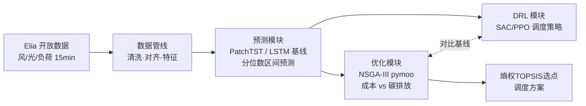

# Microgrid Dispatch: Forecasting → Multi-Objective Optimization → RL

微电网"预测—优化—学习型决策"全链路项目：深度学习功率/负荷预测 + NSGA-III 多目标日前调度 + 强化学习调度策略（本科毕设《NSGA-III多目标优化算法的编程与应用》的 Python 重构升级版）。

## 架构



**当前进度：✅ 数据管线　⬜ 预测　⬜ NSGA-III优化　⬜ DRL**

## 快速开始

```bash
pip install -r requirements.txt
pip install -e .

# 1. 下载 Elia 2024 全年数据（风电 ods031 / 光伏 ods032 / 负荷 ods001）
python scripts/download_data.py

# 2. 构建模型就绪数据集（清洗→对齐→特征），产出 parquet + 质量报告
python scripts/build_dataset.py

# 3. 生成数据探索图 -> reports/figures/
python scripts/explore_data.py

# 运行单元测试（无需真实数据）
pytest
```

## 设计要点

- **规范数据模式作为解耦边界**：所有数据源适配器输出统一的长表 schema（`src/microgrid/schema.py`），下游清洗/对齐/特征模块完全不感知数据来自哪里；新增数据源只需实现 `DataSource` 接口并注册。
- **配置驱动**：hydra 组合式 yaml（`configs/`），数据源字段名、清洗阈值、特征参数全部外置；换参数、换数据源不改代码，如 `python scripts/build_dataset.py cleaning.interpolate_gaps.max_gap_steps=16`。
- **管线各阶段为纯函数**：清洗规则、特征构造均为 `(df, cfg) -> df`，独立可测；特征全部因果（仅用过去信息），滚动统计显式 `shift(1)` 防标签泄漏，并有对应单元测试。
- **数据质量可审计**：长间隔缺失不静默填充，管线随数据集输出 `quality_report.json`（缺失率、最长缺失段、数值范围）。

## 目录结构

```
configs/            # hydra 配置组：pipeline / data / cleaning / features
src/microgrid/
  schema.py         # 规范数据模式（模块间契约）
  data/sources/     # 数据源适配器（elia / gefcom2014 + 注册表）
  data/             # cleaning / alignment / features（纯函数阶段）
  pipeline/         # 阶段编排 + 质量报告
  viz/              # 探索性可视化
scripts/            # CLI 入口（hydra）
tests/              # 单元测试（合成数据，不依赖下载）
data/               # raw / interim / processed（git 忽略）
```

## 路线图

1. ✅ 数据管线：Elia 风/光/负荷，清洗、15min 对齐、因果特征
2. ⬜ 预测：PatchTST 与 LSTM 基线，分位数损失区间预测，SHAP 可解释性
3. ⬜ 优化：pymoo NSGA-III 日前调度（成本 vs 碳排放），熵权 TOPSIS 选点
4. ⬜ DRL：SAC/PPO 调度策略，与 NSGA-III 对比（成本 / 决策时延 / 预测误差鲁棒性）
