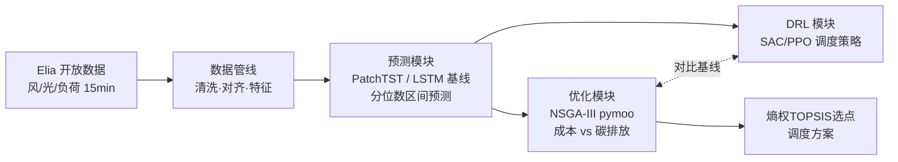

# Microgrid Dispatch: Forecasting → Multi-Objective Optimization → RL

微电网"预测—优化—学习型决策"全链路项目：深度学习功率/负荷预测 + NSGA-III 多目标日前调度 + 强化学习调度策略（本科毕设《NSGA-III多目标优化算法的编程与应用》的 Python 重构升级版）。

## 架构



**当前进度：✅ 数据管线　✅ 预测（LSTM基线）　⬜ PatchTST　✅ NSGA-III优化　⬜ DRL**

## 效果预览

比利时电网 2024 全年真实数据（Elia，15 分钟分辨率），清洗对齐后测量值 vs TSO 日前预测：


### 日前概率预测（LSTM 基线，测试集 2024-11 ~ 2024-12）

分位数损失训练（q=0.1/0.5/0.9），输出 80% 预测区间；对标季节持久性基线与 Elia 官方日前预测：

| 目标 | MAE (MW) | vs 持久性基线 | vs TSO日前预测 | 80%区间覆盖率 |
|------|---------|--------------|---------------|--------------|
| 负荷 | 260 | **+49.4%** | -1.4% | 73.3% |
| 风电 | 225 | **+79.4%** | -21.7% | 86.5% |
| 光伏 | 106 | **+38.6%** | -11.0% | 93.2% |

> 模型未使用气象数值预报（NWP），仅靠历史序列+日历特征+TSO预测输入即接近 TSO 水平（负荷差1.4%）；风电差距较大，因风电本质由天气驱动——这是后续接入 NWP 特征的明确改进方向。


### 日前多目标优化调度（NSGA-III，成本 vs 碳排放）

把全国尺度预测**下采样**成一个 notional 微电网（负荷峰值 4 MW、风电装机 2 MW、光伏装机 3 MW；缩放因子按各序列最大值反推，写在 `configs/system/default.yaml`），对某一天 96×15min 求解**运行成本 vs CO₂ 排放**的日前 Pareto 前沿。决策变量为微燃机与电池每步出力 `x = [P_mt(96), P_bat(96)]`（`P_bat>0` 放电、`<0` 充电）；电网联络线功率是功率平衡的**松弛量**，不进决策向量。SoC 上下限、终端 SoC（日内能量中性）、联络线 ±3 MW、微燃机爬坡 ±0.5 MW/步等约束进入 pymoo 的**约束向量 G**（不折叠成惩罚项）。设备/成本/排放全部是纯函数、由 `system.yaml` 驱动：微燃机二次燃料成本 + 排放因子、电池充放不对称效率 + 吞吐折旧、分时电价购/售电、仅对**购入**电量计碳。用 Das-Dennis 参考方向的 NSGA-III 搜索；为让种群摆脱"终端 SoC 等式"这道薄可行流形，加了**能量中性修复算子**（把充/放能量缩放到平衡）与启发式暖启动，并用外部存档汇集各代可行非支配解。最后用**熵权 TOPSIS** 选折中点：两目标先按**前沿各自 min-max 归一到 [0,1]** 再算熵权，避免成本因绝对基线大（≈7500 EUR、相对幅度仅约 5%）而被误判为"几乎恒定"从而权重塌缩到碳排；同时另报一个**膝点**（front 两端连线的最大垂距点）作为无权重的对照。整条 `python scripts/optimize_dispatch.py optimize.day=2024-11-15` CPU 上约 15 秒。

以 2024-11-15 为例（风/光/负荷取各自 LSTM 中位数预测）：前沿含 **92 个清晰非支配解**，成本约 7.3k–7.7k EUR/日、碳排 20.3–28.3 tCO₂/日。归一化后熵权为成本 0.16 / 碳排 0.84（碳排相对幅度更大、故权重更高，但成本不再被清零），TOPSIS 选出的是**前沿内部的折中点：成本约 7508 EUR、碳排约 20.9 tCO₂**（红星），而**膝点**落在拐点附近的 **7427 EUR、21.4 tCO₂**（绿菱）——两者都在权衡区内，而非端点。


> **关于净售电**：缩放后风光装机（2+3=5 MW）高于负荷峰值（4 MW），高渗透日理应出现向电网净售电（售价 = 购价 × 0.4、无碳信用、联络线限 ±3 MW，均已实现并有单测）。但 11–12 月测试期为冬季、光伏近乎为零——实测全期没有任何一刻风光出力超过负荷（全年也仅约 0.85 MW 峰值余量），故当前调度以购电为主。按要求**未调整缩放参数**去人为制造/规避售电；售电通道在夏季高光伏日会自然触发。

## 快速开始

```bash
pip install -r requirements.txt
pip install -e .

# 1. 下载 Elia 2024 全年数据（风电 ods031 / 光伏 ods032 / 负荷 ods001）
python scripts/download_data.py

# 2. 构建模型就绪数据集（清洗→对齐→特征），产出 parquet + 质量报告
python scripts/build_dataset.py

# 3. 生成数据探索图 -> reports/figures/
python scripts/explore_data.py

# 4. 训练日前预测模型（LSTM基线，CPU可训）
python scripts/train_forecast.py forecast.target=load
python scripts/train_forecast.py forecast.target=wind
python scripts/train_forecast.py forecast.target=solar

# 5. 日前多目标调度（NSGA-III，成本 vs 碳排放；熵权 TOPSIS 选点）
#    -> reports/figures/dispatch_*.png + models/dispatch_<day>/solution.json
python scripts/optimize_dispatch.py optimize.day=2024-11-15

# 运行单元测试（无需真实数据）
pytest
```

## 设计要点

- **规范数据模式作为解耦边界**：所有数据源适配器输出统一的长表 schema（`src/microgrid/schema.py`），下游清洗/对齐/特征模块完全不感知数据来自哪里；新增数据源只需实现 `DataSource` 接口并注册。
- **配置驱动**：hydra 组合式 yaml（`configs/`），数据源字段名、清洗阈值、特征参数全部外置；换参数、换数据源不改代码，如 `python scripts/build_dataset.py cleaning.interpolate_gaps.max_gap_steps=16`。
- **管线各阶段为纯函数**：清洗规则、特征构造均为 `(df, cfg) -> df`，独立可测；特征全部因果（仅用过去信息），滚动统计显式 `shift(1)` 防标签泄漏，并有对应单元测试。
- **数据质量可审计**：长间隔缺失不静默填充，管线随数据集输出 `quality_report.json`（缺失率、最长缺失段、数值范围）。

## 目录结构

```
configs/            # hydra 配置组：pipeline / data / cleaning / features / system / optimize
src/microgrid/
  schema.py         # 规范数据模式（模块间契约）
  data/sources/     # 数据源适配器（elia / gefcom2014 + 注册表）
  data/             # cleaning / alignment / features（纯函数阶段）
  forecast/         # 窗口数据集 / 分位数损失 / 指标 / 基线 / 训练器 / 评估
  forecast/models/  # 模型注册表（lstm；PatchTST 预留同一接口）
  optimize/         # 设备模型(纯函数) / pymoo问题 / NSGA-III / 熵权TOPSIS / 报告
  pipeline/         # 阶段编排 + 质量报告
  viz/              # 探索性可视化
scripts/            # CLI 入口（hydra）
tests/              # 单元测试（合成数据，不依赖下载）
data/               # raw / interim / processed（git 忽略）
```

## 路线图

1. ✅ 数据管线：Elia 风/光/负荷，清洗、15min 对齐、因果特征
2. ✅ 预测（一期）：seq2seq LSTM 基线，分位数区间预测，无泄漏窗口切分，时间盒断点续训
3. ⬜ 预测（二期）：PatchTST 接入同一框架，NWP 气象特征，SHAP 可解释性
4. ✅ 优化：pymoo NSGA-III 日前调度（成本 vs 碳排放），熵权 TOPSIS 选点
5. ⬜ DRL：SAC/PPO 调度策略，与 NSGA-III 对比（成本 / 决策时延 / 预测误差鲁棒性）
