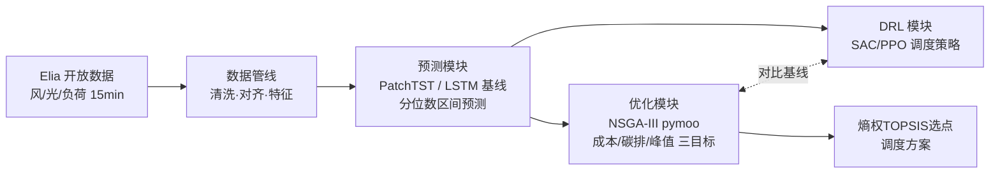
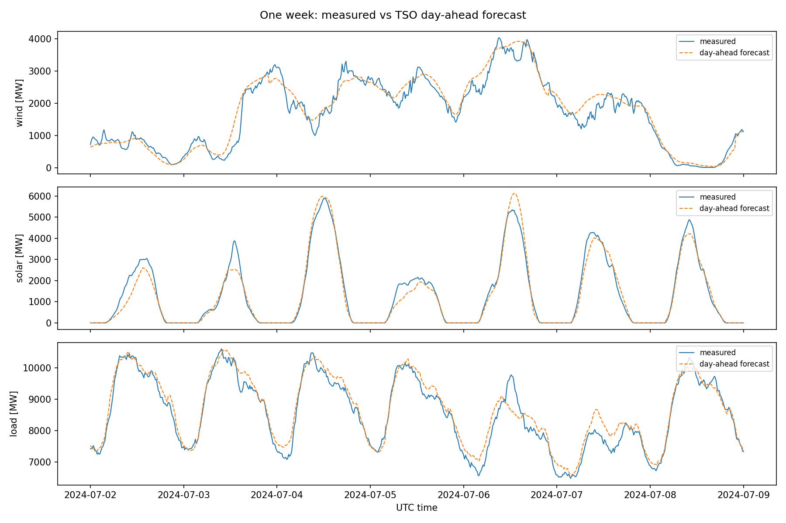
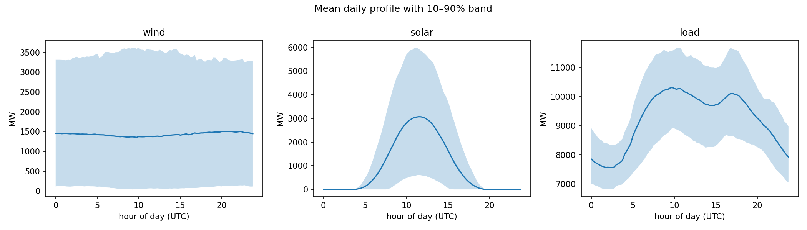
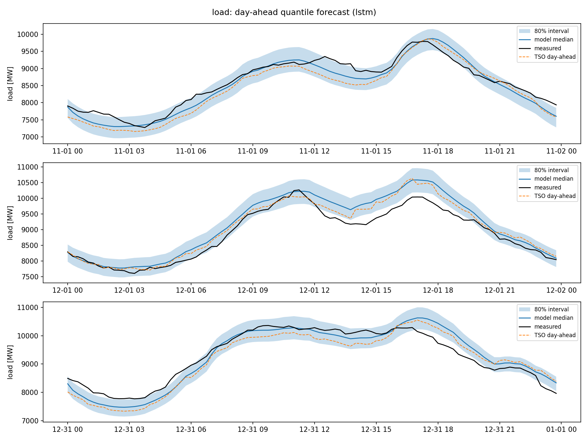
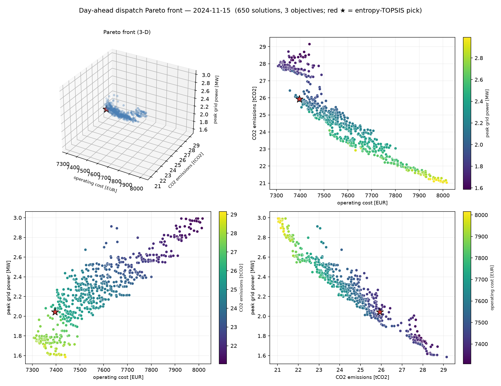
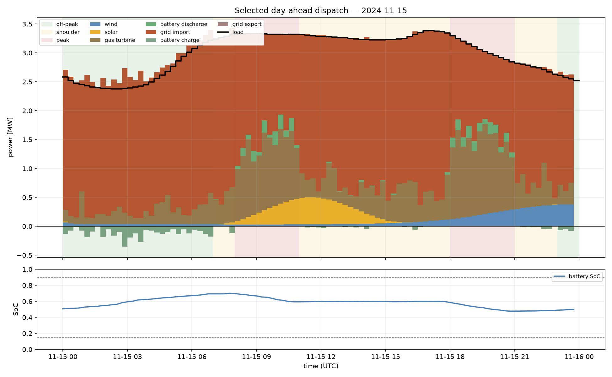
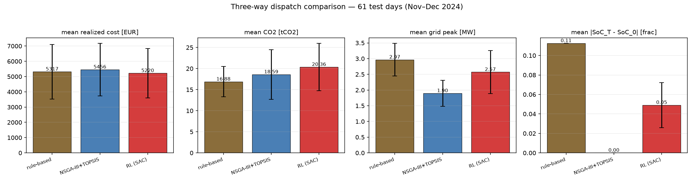
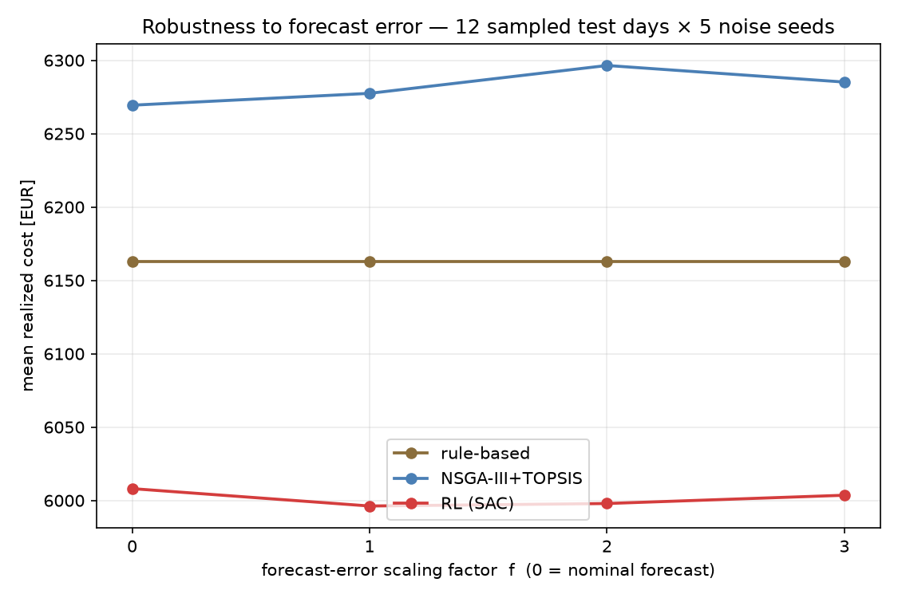

# Microgrid Dispatch: Forecasting → Multi-Objective Optimization → RL

微电网"预测—优化—学习型决策"全链路项目：深度学习功率/负荷预测 + NSGA-III 多目标日前调度 + 强化学习调度策略（本科毕设《NSGA-III多目标优化算法的编程与应用》的 Python 重构升级版）。

## 架构



**当前进度：✅ 数据管线　✅ 预测（LSTM基线）　⬜ PatchTST　✅ NSGA-III优化　✅ DRL（SAC）**

## 效果预览

比利时电网 2024 全年真实数据（Elia，15 分钟分辨率），清洗对齐后测量值 vs TSO 日前预测：





### 日前概率预测（LSTM 基线，测试集 2024-11 ~ 2024-12）

分位数损失训练（q=0.1/0.5/0.9），输出 80% 预测区间；对标季节持久性基线与 Elia 官方日前预测：

| 目标 | MAE (MW) | vs 持久性基线 | vs TSO日前预测 | 80%区间覆盖率 |
|------|---------|--------------|---------------|--------------|
| 负荷 | 260 | **+49.4%** | -1.4% | 73.3% |
| 风电 | 225 | **+79.4%** | -21.7% | 86.5% |
| 光伏 | 106 | **+38.6%** | -11.0% | 93.2% |

> 模型未使用气象数值预报（NWP），仅靠历史序列+日历特征+TSO预测输入即接近 TSO 水平（负荷差1.4%）；风电差距较大，因风电本质由天气驱动——这是后续接入 NWP 特征的明确改进方向。



### 日前多目标优化调度（NSGA-III，成本 / 碳排放 / 电网峰值三目标）

把全国尺度预测**下采样**成一个 notional 微电网（负荷峰值 4 MW、风电装机 2 MW、光伏装机 3 MW；缩放因子按各序列最大值反推，写在 `configs/system/default.yaml`），对某一天 96×15min 求解**运行成本 / CO₂ 排放 / 电网峰值功率**三目标的日前 Pareto 前沿。决策变量为微燃机与电池每步出力 `x = [P_mt(96), P_bat(96)]`（`P_bat>0` 放电、`<0` 充电）；电网联络线功率是功率平衡的**松弛量**，不进决策向量。SoC 上下限、终端 SoC（日内能量中性）、联络线 ±3 MW、微燃机爬坡 ±0.5 MW/步等约束进入 pymoo 的**约束向量 G**（不折叠成惩罚项）。

**目标是可插拔的**：每个目标是一个纯函数（`src/microgrid/optimize/objectives.py`），由 `configs/optimize/default.yaml` 的 `objectives: [cost, co2, peak_grid]` 列表选定，pymoo 问题的 `n_obj` 直接取列表长度——删掉一项即得到更低维的可行运行，**零代码改动**（`optimize.objectives=[cost,co2]` 即退化为两目标）。设备/成本/排放全部由 `system.yaml` 驱动：微燃机二次燃料成本 + 排放因子、电池充放不对称效率 + 吞吐折旧、分时电价购/售电、仅对**购入**电量计碳；`peak_grid = max_t |P_grid(t)|`（削峰、缓解公共连接点压力，与钱/碳正交，故单列一维）。

**为什么用三目标？** NSGA-III 的核心是 Das-Dennis **参考方向**：它把目标单纯形均匀铺点，用参考点做环境选择来在 **≥3 维**保持前沿的分布均匀——这正是它相对 NSGA-II 的价值所在。两目标时仅靠拥挤距离（NSGA-II）就够了，NSGA-III 并无优势；因此本项目把三目标（成本/碳排/峰值）作为主用场景。参考方向密度随目标数自适应（`ref_partitions` 按目标数配置，三目标默认 `p=12` → 91 个方向）。为让种群摆脱"终端 SoC 等式"这道薄可行流形，加了**能量中性修复算子**（把充/放能量缩放到平衡）与启发式暖启动，并用外部存档汇集各代可行非支配解。

最后用**熵权 TOPSIS** 选折中点：先按**前沿各目标各自 min-max 归一到 [0,1]** 再算熵权（避免成本因绝对基线大、相对幅度小而被误判为"几乎恒定"导致权重塌缩），该方法天然推广到 m 个目标。**膝点**（front 两端连线的最大垂距点）仅在两目标时有明确几何意义，故只对两目标运行输出、并在 `solution.json` 中注明。整条 `python scripts/optimize_dispatch.py optimize.day=2024-11-15` CPU 上约 15 秒。

以 2024-11-15 为例（风/光/负荷取各自 LSTM 中位数预测）：前沿含 **650 个非支配解**，成本约 7.3k–8.0k EUR/日、碳排 21–29 tCO₂/日、电网峰值 1.6–3.0 MW。三目标呈清晰权衡（更便宜 ⇒ 碳排更高、峰值更高）。归一化后熵权为成本 0.40 / 碳排 0.31 / 峰值 0.28（三者幅度相当，权重较均衡），TOPSIS 选出**前沿内部的折中点：成本约 7396 EUR、碳排约 25.9 tCO₂、电网峰值约 2.04 MW**（下图各面板红星）。





> **关于净售电**：缩放后风光装机（2+3=5 MW）高于负荷峰值（4 MW），高渗透日理应出现向电网净售电（售价 = 购价 × 0.4、无碳信用、联络线限 ±3 MW，均已实现并有单测）。但 11–12 月测试期为冬季、光伏近乎为零——实测全期没有任何一刻风光出力超过负荷（全年也仅约 0.85 MW 峰值余量），故当前调度以购电为主。按要求**未调整缩放参数**去人为制造/规避售电；售电通道在夏季高光伏日会自然触发。

### 强化学习调度策略（SAC，闭环）对比 NSGA-III 与规则基线

把日前调度重构成一个**序贯决策**问题：一天 96×15min 为一个 episode，智能体每步输出微燃机与电池出力 `[P_mt, P_bat]`（动作 ∈ [-1,1]，仿射映射到设备边界），电网联络线功率仍是功率平衡的**派生松弛量**。

- **环境（`src/microgrid/rl/env.py`，通过 `gymnasium` 官方 `env_checker`）**：物理**完全复用** `system.py`——为闭环新增了逐步原语（`soc_step`/`fuel_cost_step`/…），并有单测断言"逐步求和 == 原向量化整日函数"，即环境不引入任何新物理（物理来源仍唯一）。**可行性靠投影而非惩罚**：动作先被裁剪进爬坡可行区间（P_mt）与 SoC 可行区间（P_bat），投影幅度作为诊断量记录。观测（全部归一化）含 SoC、步内正余弦编码、当前实测风光负荷、未来 2h 的 LSTM 中位数预测、当前/下一步购电价、剩余步比例。
- **奖励**：`-(Δ成本 + 碳价·ΔCO₂)/尺度` 逐步累加，终端追加 `-(w_soc·|SoC_T−SoC_0| + w_peak·电网峰值)`——让"成本 / 碳排 / 峰值"三个对比指标都进入训练压力。**一个非平凡的调参教训**：`w_soc` 必须**大于**"把电池初始电量放空"的套利价值（满放约 266 EUR），否则策略会理性地在日末放空电池来压低成本，这对能量中性的 NSGA/规则基线是不公平的作弊（症状：`soc_dev` 卡在 0.35）——把 `w_soc` 从 500 提到 1500 后策略回到近似能量中性（`soc_dev≈0.03`）。
- **SAC**（Soft Actor-Critic，一种面向连续动作、同时最大化回报与策略熵以鼓励持续探索的离线策略强化学习算法；`stable-baselines3` 实现）在预测训练集（1–9 月）上训练、10 月验证、11–12 月**从不接触**直到最终对比。训练**时间盒可断点续训**（保存 replay buffer + 检查点，逐步落盘学习曲线），CPU 上约 130k 步收敛，验证集成本 5017→4826 EUR。PPO 为文档化的回退开关（`rl=ppo`）。

**三方对比（`scripts/compare_dispatch.py`，11–12 月共 61 天测试）**：三种方法拿**同一套 LSTM 中位数预测**，都通过同一条物理路径（`rollout.simulate`）对**实测真值**执行——NSGA-III+TOPSIS 每天重优化（满预算，约 10s/天）后**开环**执行、RL 策略**闭环**滚动（边观测真值边决策）、规则基线闭环。

| 方法 | 实测成本(EUR) | CO₂(tCO₂) | 电网峰值(MW) | 终端SoC偏差 | 联络线越限(步/天) | 决策时延 |
|------|:---:|:---:|:---:|:---:|:---:|:---:|
| 规则基线 | 5317 | **16.9** | 2.97 | 0.113 | 4.6 | 0.04 ms/步 |
| NSGA-III+TOPSIS | 5456 | 18.6 | **1.90** | **0.00** | **0.0** | 10.3 s/天(求解) |
| **RL(SAC)** | **5220** | 20.4 | 2.57 | 0.05 | 1.6 | 0.37 ms/步 |

> **成本差异要看配对统计，不能只看均值**：单日成本的日间波动很大（各法标准差约 ±1700 EUR），远大于方法间约 200 EUR 的均值差——只比均值不足以断言"谁更省"。把三种方法**配对到同一天**相减，日间效应相互抵消：**RL vs 规则基线** 逐日成本差 −98±**212** EUR/天、RL 在 61 天中 **72%** 更便宜；**RL vs NSGA** −236±181 EUR/天、RL **87%** 天更便宜；NSGA vs 规则基线 +138±115 EUR/天（NSGA 仅 8% 天更便宜）。配对标准差（±180~212）远小于单侧日间波动（±1700），RL 的成本优势因而是有统计支撑的，而非被方差淹没。





**诚实的结论——没有"谁全面碾压"，而是清晰的分工**：
- **RL 最省钱、最快、最抗预测误差**：实测成本均值比规则基线低 1.8%、比 NSGA 折中点低 4.3%，且**配对到同一天在 61 天中分别有 72% / 87% 更便宜**（见上表统计）；训练后单步决策仅 0.37 ms，可实时闭环；把预测误差放大 0→3 倍（上图右），RL 成本几乎不变（约 6000 EUR，最低且最平），因为它闭环观测真值、不依赖离线计划。**代价**：碳排最高（碳价只设 30 EUR/t，奖励偏向省钱）、且是黑箱、需训练。
- **NSGA-III 约束最硬、峰值最优**：显式最优化整日 Pareto 前沿，终端 SoC 精确归零、联络线零越限、电网峰值最低（1.90 MW），是可审计的日前离线方案；**代价**：单日求解约 10s、且**开环**执行——预测越差它越吃亏（上图右蓝线随误差单调抬升），综合成本最高。
- **规则基线碳排最低、免训练可解释**，但削峰最差（2.97 MW，逼近联络线上限）、终端 SoC 漂移最大、越限最多；因不看预测，鲁棒性曲线是一条水平线。

一句话：**离线、要硬约束保证 → NSGA-III；在线、要实时且抗预测误差 → RL；要极简可解释的下限 → 规则基线**。价值不在"RL 赢"，而在把三者放到同一物理引擎、同一套预测下做出的诚实、可复现对比。

## 快速开始

```bash
pip install -r requirements.txt
pip install -e .

# 1. 下载 Elia 2024 全年数据（风电 ods031 / 光伏 ods032 / 负荷 ods001）
python scripts/download_data.py

# 2. 构建模型就绪数据集（清洗→对齐→特征），产出 parquet + 质量报告
python scripts/build_dataset.py

# 3. 生成数据探索图 -> reports/figures/
python scripts/explore_data.py

# 4. 训练日前预测模型（LSTM基线，CPU可训）
python scripts/train_forecast.py forecast.target=load
python scripts/train_forecast.py forecast.target=wind
python scripts/train_forecast.py forecast.target=solar

# 5. 日前多目标调度（NSGA-III，成本/碳排/电网峰值三目标；熵权 TOPSIS 选点）
#    -> reports/figures/dispatch_*.png + models/dispatch_<day>/solution.json
python scripts/optimize_dispatch.py optimize.day=2024-11-15
python scripts/optimize_dispatch.py scenario=price_spike       # 命名场景（峰价×3）

# 6. 强化学习调度策略（SAC；1–9月训练/10月验证，时间盒可断点续训）
#    -> models/rl_sac/{best,last}.zip + eval.csv 学习曲线
python scripts/train_rl.py                       # 完整 SAC 训练（CPU < ~2h）
python scripts/train_rl.py rl=ppo                # 回退开关：改用 PPO
python scripts/train_rl.py rl.train.max_seconds=470   # 时间盒一段，可重复运行续训

# 7. 三方对比（RL vs NSGA-III+TOPSIS vs 规则基线；11–12月测试，可断点续算）
#    -> models/comparison/comparison.json + reports/figures/dispatch_comparison_*.png
python scripts/compare_dispatch.py

# 运行单元测试（无需真实数据；默认排除重场景解）
pytest              # 快速套件（-m "not slow" 已在 pyproject 配置）
pytest -m slow      # 场景端到端 + RL 冒烟：缩减预算 NSGA-III / 小 SAC 训练 + 断言校验
```

## 设计要点

- **规范数据模式作为解耦边界**：所有数据源适配器输出统一的长表 schema（`src/microgrid/schema.py`），下游清洗/对齐/特征模块完全不感知数据来自哪里。
- **组合靠配置，不靠注册表**：可插拔组件（数据源、预测模型、调度目标）在 yaml 里用导入路径 `_target_: microgrid.x.y.Class` 声明，由**唯一的装配器中间件** `src/microgrid/assemble.py`（`hydra.utils.instantiate` 的薄封装）实例化——无装饰器注册表、无 `名字→类` 字典、无导入副作用。新增组件 = 一个新模块 + 一行 yaml。脚本/管线只调用装配器，模块之间从不互相 import 具体类。
- **配置驱动**：hydra 组合式 yaml（`configs/`），数据源字段名、清洗阈值、特征参数、目标列表、场景定义全部外置；换参数、换数据源不改代码，如 `python scripts/build_dataset.py cleaning.interpolate_gaps.max_gap_steps=16`、`optimize.objectives=[cost,co2]`。
- **管线各阶段为纯函数**：清洗规则、特征构造均为 `(df, cfg) -> df`，独立可测；特征全部因果（仅用过去信息），滚动统计显式 `shift(1)` 防标签泄漏，并有对应单元测试。
- **场景系统**：`configs/scenario/*.yaml` 定义命名场景（日期、系统参数覆写、期望性质断言）。运行时 `python scripts/optimize_dispatch.py scenario=price_spike`；测试端 `tests/test_scenarios.py` 自动发现每个 yaml 并参数化（用例 id = 文件名），跑缩减预算的优化并校验断言，新增场景 = 新增一个 yaml、零测试代码增长。
- **数据质量可审计**：长间隔缺失不静默填充，管线随数据集输出 `quality_report.json`（缺失率、最长缺失段、数值范围）。

## 目录结构

```
configs/            # hydra 配置组：pipeline / data / cleaning / features / system
  optimize/         #   优化设置 + objectives/（cost·co2·peak_grid 各一 _target_ 文件）
  scenario/         #   命名场景（winter_weekday / winter_weekend_low_load / price_spike）
src/microgrid/
  schema.py         # 规范数据模式（模块间契约）
  assemble.py       # 唯一的“配置→实例”装配器（build_source / build_model / build_objectives）
  data/sources/     # 数据源适配器（elia / gefcom2014，由 yaml 的 _target_ 装配）
  data/             # cleaning / alignment / features（纯函数阶段）
  forecast/         # 窗口数据集 / 分位数损失 / 指标 / 基线 / 训练器 / 评估
  forecast/models/  # 模型（lstm；PatchTST 预留同一 forward 契约，_target_ 装配）
  optimize/         # 设备物理(纯函数,含逐步原语) / objectives / pymoo问题 / NSGA-III /
                    #   熵权TOPSIS / 场景覆写(scenario) / inputs(日输入) / 报告
  rl/               # DRL 调度：env(gymnasium) / data(日profile) / baseline(规则) /
                    #   rollout(闭环执行+指标) / train(SAC/PPO,可续训) / report
  pipeline/         # 阶段编排 + 质量报告
  viz/              # 探索性可视化
scripts/            # CLI 入口（hydra；train_rl / compare_dispatch 等）
tests/              # 单元测试（合成数据，不依赖下载）；重场景解 + RL 冒烟标 @slow
data/               # raw / interim / processed（git 忽略）
```

## 路线图

1. ✅ 数据管线：Elia 风/光/负荷，清洗、15min 对齐、因果特征
2. ✅ 预测（一期）：seq2seq LSTM 基线，分位数区间预测，无泄漏窗口切分，时间盒断点续训
3. ⬜ 预测（二期）：PatchTST 接入同一框架，NWP 气象特征，SHAP 可解释性
4. ✅ 优化：pymoo NSGA-III 日前调度（成本/碳排/电网峰值三目标，可插拔），熵权 TOPSIS 选点，命名场景系统
5. ✅ DRL：SAC 闭环调度策略，与 NSGA-III / 规则基线三方对比（成本 / 碳排 / 峰值 / 决策时延 / 预测误差鲁棒性）；物理复用 system.py 单一来源，时间盒可断点续训
