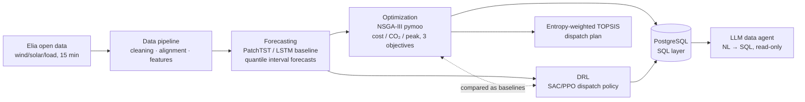
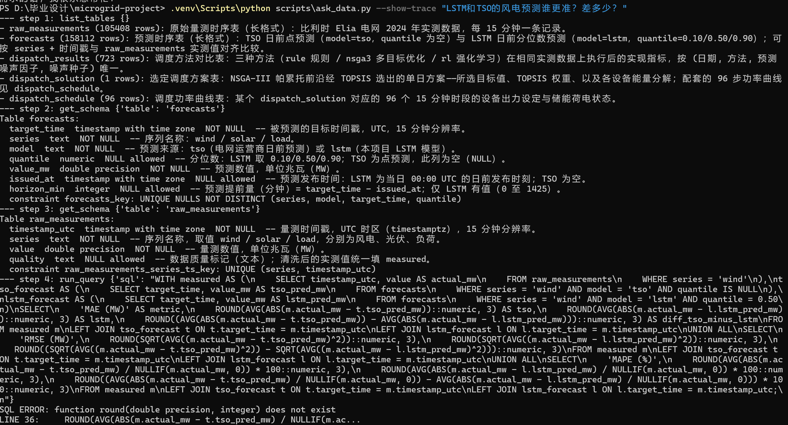
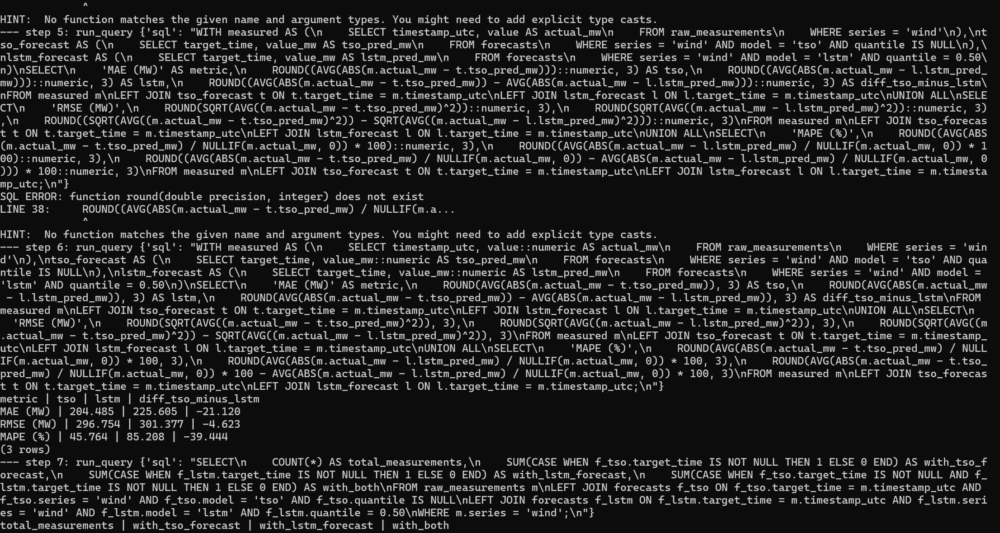
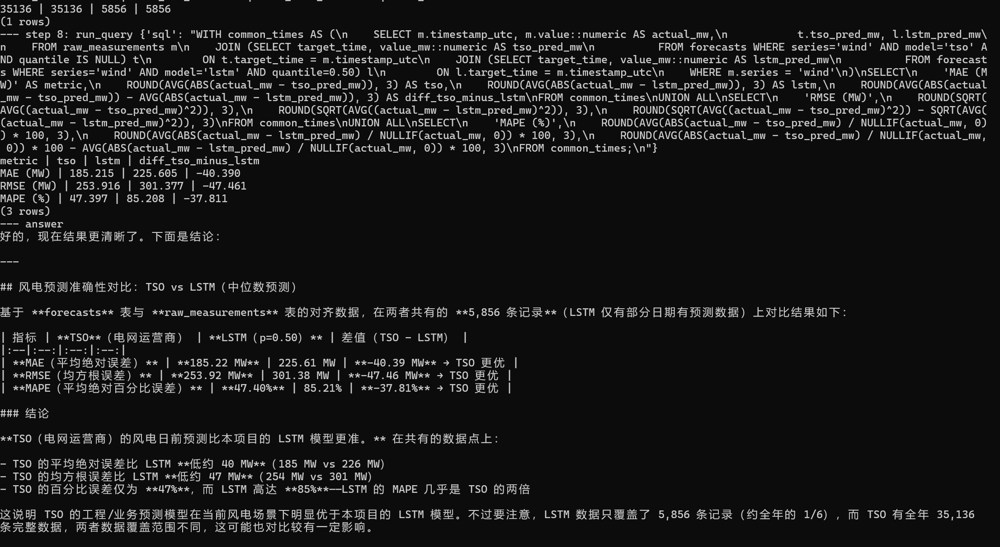

# Microgrid Dispatch: Forecasting → Multi-Objective Optimization → RL

An end-to-end "forecasting → optimization → learning-based decision" microgrid project: deep-learning power/load forecasting + NSGA-III multi-objective day-ahead dispatch + a reinforcement-learning dispatch policy, topped by a PostgreSQL data layer and an LLM data agent (a Python rebuild and upgrade of my undergraduate thesis *Programming and Application of the NSGA-III Multi-Objective Optimization Algorithm*).

## Architecture



**Status: ✅ data pipeline　✅ forecasting (LSTM baseline)　⬜ PatchTST　✅ NSGA-III optimization　✅ DRL (SAC)　✅ SQL data layer　✅ data agent (NL→SQL)**

## Results preview

One year of real Belgian grid data (Elia, 15-minute resolution); cleaned and aligned measurements vs the TSO's day-ahead forecast:


### Day-ahead probabilistic forecasting (LSTM baseline, test set 2024-11 – 2024-12)

Trained with quantile loss (q = 0.1/0.5/0.9), producing 80% prediction intervals; benchmarked against a seasonal-persistence baseline and Elia's official day-ahead forecast:

| Target | MAE (MW) | vs persistence | vs TSO day-ahead | 80% interval coverage |
|--------|---------|----------------|------------------|----------------------|
| Load   | 260 | **+49.4%** | -1.4% | 73.3% |
| Wind   | 225 | **+79.4%** | -21.7% | 86.5% |
| Solar  | 106 | **+38.6%** | -11.0% | 93.2% |

> The model uses no numerical weather prediction (NWP) — with history, calendar features and the TSO forecast as inputs alone it already approaches TSO level (load within 1.4%). The wind gap is larger because wind is fundamentally weather-driven — a clear improvement direction: NWP features.


### Day-ahead multi-objective dispatch (NSGA-III; cost / CO₂ emissions / grid peak)

The national-scale forecasts are **downscaled** to a notional microgrid (peak load 4 MW, wind capacity 2 MW, solar capacity 3 MW; scaling factors derived from each series' maximum, defined in `configs/system/default.yaml`). For a given day (96 × 15 min) the day-ahead Pareto front is solved over three objectives: **operating cost / CO₂ emissions / grid peak power**. Decision variables are the per-step outputs of the micro gas turbine and the battery, `x = [P_mt(96), P_bat(96)]` (`P_bat > 0` discharging, `< 0` charging); the grid tie-line power is the **slack** of the power balance and never enters the decision vector. SoC bounds, terminal SoC (intra-day energy neutrality), tie-line ±3 MW and turbine ramp ±0.5 MW/step enter pymoo's **constraint vector G** (not folded into penalty terms).

**Objectives are pluggable**: each objective is a pure function (`src/microgrid/optimize/objectives.py`) selected by the `objectives: [cost, co2, peak_grid]` list in `configs/optimize/default.yaml`; the pymoo problem's `n_obj` is simply the list length — removing an entry yields a valid lower-dimensional run with **zero code change** (`optimize.objectives=[cost,co2]` degrades to two objectives). Devices, costs and emissions are all driven by `system.yaml`: quadratic turbine fuel cost + emission factor, asymmetric battery charge/discharge efficiency + throughput degradation, time-of-use buy/sell tariffs, carbon counted only on **imported** energy; `peak_grid = max_t |P_grid(t)|` (peak shaving, relieving stress at the point of common coupling — orthogonal to money/carbon, hence its own dimension).

**Why three objectives?** The core of NSGA-III is Das–Dennis **reference directions**: they tile the objective simplex uniformly and use reference points in environmental selection to keep the front evenly distributed in **≥3 dimensions** — precisely its value over NSGA-II. With two objectives, crowding distance (NSGA-II) suffices and NSGA-III has no advantage; this project therefore treats the three-objective case (cost/CO₂/peak) as the primary scenario. Reference-direction density adapts to the number of objectives (`ref_partitions` configured per objective count; three objectives default to `p=12` → 91 directions). To help the population escape the thin feasible manifold of the terminal-SoC equality, an **energy-neutrality repair operator** (rescaling charge/discharge energy into balance) and heuristic warm starts were added, with an external archive collecting feasible non-dominated solutions across generations.

Finally, **entropy-weighted TOPSIS** picks the compromise point: each objective is min-max normalised to [0,1] **over the front** before computing entropy weights (this prevents weight collapse when cost — large in absolute baseline but small in relative range — is mistaken for "nearly constant"); the method generalises naturally to m objectives. The **knee point** (maximum perpendicular distance to the line joining the front's endpoints) has clear geometric meaning only with two objectives, so it is reported only for two-objective runs and noted in `solution.json`. The full `python scripts/optimize_dispatch.py optimize.day=2024-11-15` run takes ~15 s on CPU.

For 2024-11-15 (wind/solar/load taken as their LSTM median forecasts): the front contains **650 non-dominated solutions**, cost ≈ 7.3k–8.0k EUR/day, CO₂ 21–29 t/day, grid peak 1.6–3.0 MW, with clear trade-offs (cheaper ⇒ more carbon, higher peak). Normalised entropy weights come out as cost 0.40 / CO₂ 0.31 / peak 0.28 (comparable magnitudes, fairly balanced weights), and TOPSIS selects an **interior compromise point: ≈ 7,396 EUR, ≈ 25.9 tCO₂, ≈ 2.04 MW grid peak** (red star in each panel below).


> **On net export**: after scaling, wind + solar capacity (2 + 3 = 5 MW) exceeds peak load (4 MW), so high-penetration days should see net export to the grid (sell price = 0.4 × buy price, no carbon credit, tie-line limited to ±3 MW — all implemented and unit-tested). But the Nov–Dec test window is winter with near-zero solar: in the measured data renewable output never exceeds load at any step (the whole year offers only ~0.85 MW of peak margin), so dispatch is import-dominated. Scaling parameters were deliberately **not** tuned to manufacture or avoid export; the export path triggers naturally on high-solar summer days.

### RL dispatch policy (SAC, closed-loop) vs NSGA-III and a rule-based baseline

Day-ahead dispatch is recast as a **sequential decision** problem: one day of 96 × 15 min is an episode; at each step the agent outputs turbine and battery power `[P_mt, P_bat]` (actions ∈ [-1,1], affinely mapped to device bounds); the grid tie-line remains the **derived slack** of the power balance.

- **Environment** (`src/microgrid/rl/env.py`, passes the official `gymnasium` `env_checker`): the physics **fully reuses** `system.py` — per-step primitives (`soc_step`/`fuel_cost_step`/…) were added for the closed loop, with unit tests asserting that "step-wise sums == the original vectorised whole-day functions", i.e. the environment introduces no new physics (the source of physics stays unique). **Feasibility via projection, not penalties**: actions are first clipped into the ramp-feasible interval (P_mt) and the SoC-feasible interval (P_bat), with projection magnitude logged as a diagnostic. Observations (all normalised) include SoC, sinusoidal within-day step encoding, current measured wind/solar/load, the next 2 h of LSTM median forecasts, current/next buy price, and the remaining-steps fraction.
- **Reward**: `-(Δcost + carbon_price·ΔCO₂)/scale` accumulated per step, plus a terminal `-(w_soc·|SoC_T−SoC_0| + w_peak·grid_peak)` — so that all three comparison metrics (cost / CO₂ / peak) exert training pressure. **A non-trivial tuning lesson**: `w_soc` must be **greater than** the arbitrage value of draining the battery's initial charge (~266 EUR for a full discharge), otherwise the policy rationally empties the battery at day's end to cut cost — unfair cheating against the energy-neutral NSGA/rule baselines (symptom: `soc_dev` stuck at 0.35). Raising `w_soc` from 500 to 1500 restored near energy-neutrality (`soc_dev ≈ 0.03`).
- **SAC** (Soft Actor-Critic — an off-policy RL algorithm for continuous actions that maximises return plus policy entropy to sustain exploration; `stable-baselines3` implementation) is trained on the forecast training period (Jan–Sep), validated on October, and **never touches** Nov–Dec until the final comparison. Training is **time-boxed and resumable** (replay buffer + checkpoints saved, learning curves flushed incrementally), converging in ~130k steps on CPU; validation cost 5017 → 4826 EUR. PPO is a documented fallback switch (`rl=ppo`).

**Three-way comparison (`scripts/compare_dispatch.py`, 61 test days, Nov–Dec)**: all three methods receive the **same LSTM median forecasts** and are executed against **measured ground truth** through the same physical path (`rollout.simulate`) — NSGA-III+TOPSIS re-optimises each day (full budget, ~10 s/day) and then runs **open-loop**; the RL policy rolls **closed-loop** (observing ground truth as it decides); the rule baseline runs closed-loop.

| Method | Realised cost (EUR) | CO₂ (t) | Grid peak (MW) | Terminal SoC dev. | Tie-line violations (steps/day) | Decision latency |
|--------|:---:|:---:|:---:|:---:|:---:|:---:|
| Rule baseline | 5317 | **16.9** | 2.97 | 0.113 | 4.6 | 0.04 ms/step |
| NSGA-III+TOPSIS | 5456 | 18.6 | **1.90** | **0.00** | **0.0** | 10.3 s/day (solve) |
| **RL (SAC)** | **5220** | 20.4 | 2.57 | 0.05 | 1.6 | 0.37 ms/step |

> **Cost differences require paired statistics, not just means**: single-day cost varies a lot from day to day (σ ≈ ±1,700 EUR for every method), dwarfing the ~200 EUR gaps between method means — comparing means alone cannot establish "who is cheaper". Pairing the methods **on the same day** and differencing cancels the day effect: **RL vs rule baseline** −98 ± **212** EUR/day, RL cheaper on **72%** of the 61 days; **RL vs NSGA** −236 ± 181 EUR/day, RL cheaper on **87%** of days; NSGA vs rule baseline +138 ± 115 EUR/day (NSGA cheaper on only 8% of days). The paired σ (±180–212) is far below the single-method day-to-day variance (±1,700), so RL's cost advantage is statistically supported rather than drowned in variance.


**The honest conclusion — no method dominates; there is a clear division of labour**:
- **RL is the cheapest, fastest and most robust to forecast error**: mean realised cost 1.8% below the rule baseline and 4.3% below the NSGA compromise point, and — paired to the same day — cheaper on **72% / 87%** of the 61 days respectively (statistics in the table note above); after training, a decision takes only 0.37 ms, enabling a real-time closed loop; amplifying forecast error 0→3× (figure above right) barely moves RL's cost (~6,000 EUR, lowest and flattest), because it observes ground truth closed-loop instead of relying on an offline plan. **The price**: highest CO₂ (carbon price set at only 30 EUR/t, so the reward skews toward saving money), a black box, and it needs training.
- **NSGA-III has the hardest constraint guarantees and the best peak**: it explicitly optimises the whole-day Pareto front, hits terminal SoC exactly zero, zero tie-line violations, and the lowest grid peak (1.90 MW) — an auditable day-ahead offline plan. **The price**: ~10 s per day to solve and **open-loop** execution — the worse the forecast, the more it suffers (the blue curve rises monotonically with error), giving the highest overall cost.
- **The rule baseline has the lowest CO₂ and is training-free and interpretable**, but the worst peak shaving (2.97 MW, close to the tie-line limit), the largest terminal SoC drift and the most violations; since it ignores forecasts, its robustness curve is a flat line.

In one line: **offline with hard-constraint guarantees → NSGA-III; online, real-time and robust to forecast error → RL; a minimal interpretable floor → rule baseline.** The value is not "RL wins" but an honest, reproducible comparison of all three on the same physics engine and the same forecasts.

### SQL data layer + data agent (natural-language querying)

The pipeline's outputs (measurements, forecasts, dispatch experiments), previously scattered across parquet/JSON files, are loaded into a **PostgreSQL relational layer**: 5 tables, ~260k rows, idempotent bulk loading (COPY into a staging table + `ON CONFLICT DO UPDATE`), business `COMMENT`s on every table and column, plus 8 analysis queries with business conclusions (`sql/analysis/`).

On top of the database sits an **LLM data agent** (`scripts/ask_data.py`): through three tools — `list_tables / get_schema / run_query` — the model autonomously explores the schema (the column comments double as its semantic annotations), writes and executes SQL, self-corrects after errors, and answers with cited numbers in the language of the question.

```bash
python scripts/ask_data.py --show-trace "Which month of 2024 had the largest wind forecast error?"
```

A real traced run (question asked in Chinese — "Which wind forecast is more accurate, LSTM or the TSO?"; DeepSeek backend; the full trace of a single run):







Steps 2 and 3 happened **without any human prompting**: the first LEFT JOIN produced a TSO MAE of 204.5 MW, diluted by full-year data; the agent checked the coverage itself and corrected the comparison basis.

Safety is **belt-and-braces**: a pure-function SQL validator (single SELECT/WITH statements only; blocks write keywords, multi-statement injection, `SELECT INTO`, and data-modifying CTEs) + database-side `READ ONLY` transactions with a statement timeout — **model-generated SQL is never trusted; the database enforces the rules** (the same philosophy as unique-key constraints). Any OpenAI-compatible endpoint works (`configs/agent/default.yaml`); API keys are read from environment variables only.

## Quick start

```bash
pip install -r requirements.txt
pip install -e .

# 1. Download the full-year 2024 Elia data (wind ods031 / solar ods032 / load ods001)
python scripts/download_data.py

# 2. Build the model-ready dataset (cleaning → alignment → features): parquet + quality report
python scripts/build_dataset.py

# 3. Generate data-exploration figures -> reports/figures/
python scripts/explore_data.py

# 4. Train the day-ahead forecast models (LSTM baseline, trains on CPU)
python scripts/train_forecast.py forecast.target=load
python scripts/train_forecast.py forecast.target=wind
python scripts/train_forecast.py forecast.target=solar

# 5. Day-ahead multi-objective dispatch (NSGA-III: cost/CO₂/grid-peak; entropy-weighted TOPSIS pick)
#    -> reports/figures/dispatch_*.png + models/dispatch_<day>/solution.json
python scripts/optimize_dispatch.py optimize.day=2024-11-15
python scripts/optimize_dispatch.py scenario=price_spike       # named scenario (peak price ×3)

# 6. RL dispatch policy (SAC; train Jan–Sep / validate Oct; time-boxed, resumable)
#    -> models/rl_sac/{best,last}.zip + eval.csv learning curves
python scripts/train_rl.py                       # full SAC training (CPU < ~2 h)
python scripts/train_rl.py rl=ppo                # fallback switch: use PPO instead
python scripts/train_rl.py rl.train.max_seconds=470   # one time-boxed slice; rerun to resume

# 7. Three-way comparison (RL vs NSGA-III+TOPSIS vs rule baseline; Nov–Dec test, resumable)
#    -> models/comparison/comparison.json + reports/figures/dispatch_comparison_*.png
python scripts/compare_dispatch.py

# 8. SQL layer + data agent (needs local PostgreSQL; connection via PG* env vars or .env)
python scripts/load_to_db.py                     # create tables + idempotent load (default DB: microgrid)
python scripts/ask_data.py "Which wind forecast is more accurate, LSTM or the TSO?"
python scripts/ask_data.py --show-trace "Which dispatch method is cheapest?"   # print every SQL step

# Run the unit tests (no real data needed; heavy runs excluded by default)
pytest              # fast suite (-m "not slow" preconfigured in pyproject)
pytest -m slow      # scenario end-to-end + RL smoke: reduced-budget NSGA-III / small SAC training + assertions
```

## Design principles

- **A canonical data schema as the decoupling boundary**: every data-source adapter emits the same long-format schema (`src/microgrid/schema.py`); downstream cleaning/alignment/feature modules never know where the data came from.
- **Composition by configuration, not registries**: pluggable components (data sources, forecast models, dispatch objectives) are declared in yaml by import path (`_target_: microgrid.x.y.Class`) and instantiated by the **single assembler middleware** `src/microgrid/assemble.py` (a thin wrapper over `hydra.utils.instantiate`) — no decorator registries, no name→class dictionaries, no import side effects. Adding a component = one new module + one line of yaml. Scripts/pipelines call only the assembler; modules never import each other's concrete classes.
- **Configuration-driven**: hydra composable yaml (`configs/`); data-source field names, cleaning thresholds, feature parameters, objective lists and scenario definitions are all externalised — changing parameters or data sources requires no code change, e.g. `python scripts/build_dataset.py cleaning.interpolate_gaps.max_gap_steps=16`, `optimize.objectives=[cost,co2]`.
- **Pure-function pipeline stages**: cleaning rules and feature construction are all `(df, cfg) -> df`, independently testable; all features are causal (past information only), rolling statistics use an explicit `shift(1)` against label leakage, with corresponding unit tests.
- **Scenario system**: `configs/scenario/*.yaml` defines named scenarios (date, system-parameter overrides, expected-property assertions). At runtime: `python scripts/optimize_dispatch.py scenario=price_spike`; on the test side, `tests/test_scenarios.py` auto-discovers every yaml and parameterises it (test id = file name), running reduced-budget optimisation and checking the assertions — a new scenario is one new yaml with zero test-code growth.
- **Auditable data quality**: long gaps are never silently filled; the pipeline ships a `quality_report.json` (missing rates, longest gap, value ranges) alongside every dataset.

## Layout

```
configs/            # hydra config groups: pipeline / data / cleaning / features / system
  optimize/         #   optimisation settings + objectives/ (one _target_ file each: cost · co2 · peak_grid)
  scenario/         #   named scenarios (winter_weekday / winter_weekend_low_load / price_spike)
  agent/            #   data-agent settings (endpoint, model, step budget, row/timeout limits)
sql/                # schema DDL (5 commented tables) + 8 business analysis queries
src/microgrid/
  schema.py         # canonical data schema (the inter-module contract)
  assemble.py       # the single "config → instance" assembler (build_source / build_model / build_objectives)
  data/sources/     # data-source adapters (elia / gefcom2014, assembled via yaml _target_)
  data/             # cleaning / alignment / features (pure-function stages)
  forecast/         # windowed datasets / quantile loss / metrics / baselines / trainer / evaluation
  forecast/models/  # models (lstm; PatchTST reserved behind the same forward contract)
  optimize/         # device physics (pure functions incl. per-step primitives) / objectives /
                    #   pymoo problem / NSGA-III / entropy TOPSIS / scenario overrides / daily inputs / reports
  rl/               # DRL dispatch: env (gymnasium) / data (daily profiles) / baseline (rules) /
                    #   rollout (closed-loop execution + metrics) / train (SAC/PPO, resumable) / report
  sql/              # SQL layer: db.py (connections / COPY / upsert) / extract.py (pure DataFrame→row transforms)
  agent/            # data agent: tools / guard (SQL validator) / loop (function-calling) / prompts
  pipeline/         # stage orchestration + quality report
  viz/              # exploratory visualisation
scripts/            # CLI entry points (hydra; train_rl / compare_dispatch / load_to_db / ask_data …)
tests/              # unit tests (synthetic data, no downloads); heavy scenario + RL smoke marked @slow
data/               # raw / interim / processed (git-ignored)
```

## Roadmap

1. ✅ Data pipeline: Elia wind/solar/load; cleaning, 15-min alignment, causal features
2. ✅ Forecasting (phase 1): seq2seq LSTM baseline, quantile interval forecasts, leakage-free window splits, time-boxed resumable training
3. ⬜ Forecasting (phase 2): PatchTST plugged into the same framework, NWP weather features, SHAP explainability
4. ✅ Optimisation: pymoo NSGA-III day-ahead dispatch (cost/CO₂/grid-peak, pluggable objectives), entropy-weighted TOPSIS pick, named-scenario system
5. ✅ DRL: SAC closed-loop dispatch policy, three-way comparison vs NSGA-III / rule baseline (cost / CO₂ / peak / decision latency / forecast-error robustness); physics reused from the single source system.py; time-boxed resumable training
6. ✅ SQL layer: PostgreSQL, 5 tables ~260k rows, idempotent loading (COPY + ON CONFLICT), business comments on every table/column, 8 analysis queries
7. ✅ Data agent: LLM tool-calling loop (explore schema → write SQL → self-correct on errors), belt-and-braces read-only safety (pure-function validator + READ ONLY transactions), any OpenAI-compatible endpoint, fully offline unit tests via an injected fake LLM client
