**English** | [简体中文](README.zh-CN.md)

# Microgrid Dispatch: Forecasting → Multi-Objective Optimization → RL

An end-to-end "forecasting → optimization → learning-based decision" microgrid project: deep-learning power/load forecasting + NSGA-III multi-objective day-ahead dispatch + a reinforcement-learning dispatch policy, topped by a PostgreSQL data layer and an LLM data agent (a Python rebuild and upgrade of my undergraduate thesis *Programming and Application of the NSGA-III Multi-Objective Optimization Algorithm*).

## Architecture

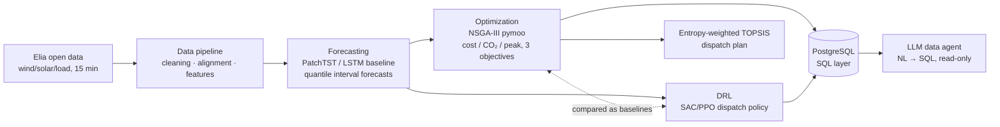
```mermaid
flowchart LR
    A[Elia open data<br>wind/solar/load, 15 min] --> B[Data pipeline<br>cleaning · alignment · features]
    B --> C[Forecasting<br>PatchTST / LSTM baseline<br>quantile interval forecasts]
    C --> D[Optimization<br>NSGA-III pymoo<br>cost / CO₂ / peak, 3 objectives]
    C --> E[DRL<br>SAC/PPO dispatch policy]
    D <-.compared as baselines.-> E
    D --> F[Entropy-weighted TOPSIS<br>dispatch plan]
    D --> G[(PostgreSQL<br>SQL layer)]
    E --> G
    G --> H[LLM data agent<br>NL → SQL, read-only]
```

| Stage | Status |
|-------|--------|
| Data pipeline — Elia 2019–2024, cleaning, alignment, causal features | Complete |
| Day-ahead probabilistic forecasting — seq2seq LSTM, quantile intervals | Complete |
| NWP weather features — 48 h lead; value shown to be conditional on the input set | Complete |
| PatchTST vs LSTM architecture comparison — LSTM wins on wind, three-seed ranges disjoint | Complete |
| NSGA-III multi-objective dispatch + entropy-weighted TOPSIS | Complete |
| DRL dispatch policy (SAC) + three-way comparison | Complete |
| Forecast-value transfer function — what forecast accuracy is worth to dispatch | Complete |
| MILP optimality gap — how far the heuristic's plan is from the proven optimum | Complete |
| LP-plan execution check — does the proven optimum survive contact with the actuals | Complete |
| Static tie-line margin — one number that makes the LP plan dispatchable, and its price | Complete |
| PostgreSQL data layer | Complete |
| LLM data agent (natural language → SQL) | Complete |

## Results preview

Six years of real Belgian grid data (Elia, 15-minute resolution, 2019-01 → 2024-12;
the solar dataset only begins 2020-07); cleaned and aligned measurements vs the
TSO's day-ahead forecast:

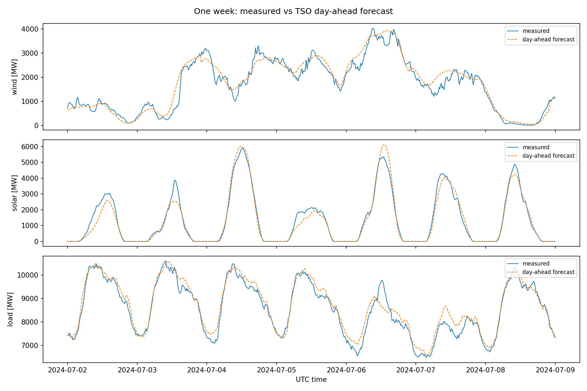

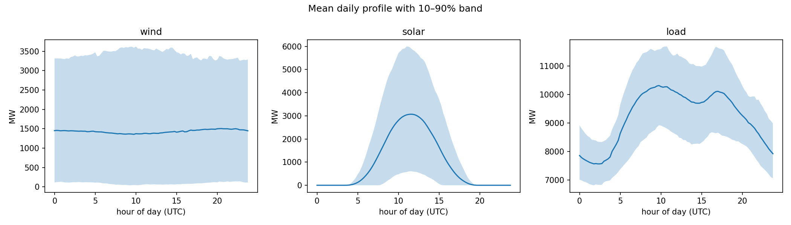

### Day-ahead probabilistic forecasting

**Data.** Elia open data at 15-min resolution, 2019-01 → 2024-12 (the solar
dataset only starts 2020-07, so windows before then are dropped for every
target). Chronological split, never shuffled: train → 2024-09 (~18k windows),
validation = Oct 2024 (372), test = Nov–Dec 2024 (721). The test period is
untouched until final evaluation.

**Model.** Seq2seq LSTM, ~40k parameters, trains on CPU in ~1 min per target.
Quantile loss at q = 0.1/0.5/0.9 gives 80% prediction intervals. The encoder
reads 24 h of measured wind/solar/load; the decoder is driven only by features
known at issue time (calendar encodings + Elia's published day-ahead forecast).
Direct multi-horizon — the model's own output is never fed back, so error does
not compound along the horizon.

**Results** (test set, 721 windows; every baseline evaluated on *identical*
windows):

| Target | MAE (MW) | vs persistence | vs Elia DA | vs bias-corrected Elia | 80% coverage |
|--------|---------:|---------------:|-----------:|-----------------------:|-------------:|
| Load   | 256.1 | +50.2% | +0.2% (tie) | +1.3% | 0.827 |
| Solar  |  92.2 | +46.4% | **+3.1%**   | +6.5% | 0.646 *(daylight)* |
| Wind   | 225.1 | +79.4% | **−21.6%**  | +6.1% | 0.852 |

Reference MAEs — seasonal persistence 514.2 / 172.1 / 1093.3, Elia day-ahead
256.6 / 95.1 / 185.1, and a **zero-parameter** hour-of-day bias correction of
Elia's forecast 259.3 / 98.6 / 239.8 (load / solar / wind).

#### Where does the skill actually come from?

The headline table is not self-explanatory: Elia's own day-ahead forecast is
one of the model's inputs, so "beats persistence by 79%" could mean the model
is good, or merely that it copies a good input. Three ablations, each varying
exactly one thing, settle it.

**1 — Remove Elia's forecast from the inputs.**

| Target | history + calendar only | + Elia DA forecast |
|--------|------------------------:|-------------------:|
| Load   | 482.4 *(+6.2% vs persistence)*  | 256.1 *(+50.2%)* |
| Solar  | 168.4 *(+2.1%)*                 |  92.2 *(+46.4%)* |
| Wind   | 1299.7 *(**−18.9%**)*           | 225.1 *(+79.4%)* |

Without it the model is barely better than "tomorrow = yesterday", and for wind
it is *worse*. Essentially all of the headline skill is Elia's forecast being
passed through; the model's own contribution is the correction it applies on
top of it.

**2 — Add four more years of training data** (3.3k → 18k windows). The original
training period was 2024-01…09 and contained **no November or December at all**,
so the test season was pure extrapolation — `doy_sin/doy_cos` took values never
seen in training.

| Target | trained on 2024-01…09 | trained on 2020-07…2024-09 |
|--------|----------------------:|---------------------------:|
| Load   | 260.1 *(−1.4% vs Elia)* | 256.1 *(**+0.2%**)* |
| Solar  | 105.6 *(−11.0%)*        |  92.2 *(**+3.1%**)* |
| Wind   | 225.3 *(−21.7%)*        | 225.1 *(−21.6%)* |

Seasonal coverage was the binding constraint for **solar and load** — both flip
from losing to Elia to matching or beating it, with no change to the model, the
architecture, or a single hyperparameter. For **wind**, 5.4× the data changes
nothing.

**3 — Evaluate the same checkpoint on all three splits.** MAE in MW:

| Target | model (train / val / test) | Elia (train / val / test) |
|--------|----------------------------|---------------------------|
| Load   | 241.6 / 186.4 / 256.1 | 249.1 / 177.7 / 256.6 |
| Solar  | 107.7 / 141.7 /  92.2 | 109.4 / 138.0 /  95.1 |
| Wind   | 232.7 / 240.0 / 225.1 | 269.5 / 209.9 / 185.1 |

For load and solar the model's error **moves with Elia's** across periods: when
a period is intrinsically harder, both degrade together. For wind the model's
error is flat — 225–240 MW in all three periods — while Elia's ranges from 269
down to 185. The model does not track the underlying predictability of the
weather, because it cannot see it. Its apparent 37 MW "win" on the training
period is not skill: it is Elia happening to be worse over 2020–2024 than over
the test window, while the model sits on a ~225 MW floor it cannot get below.

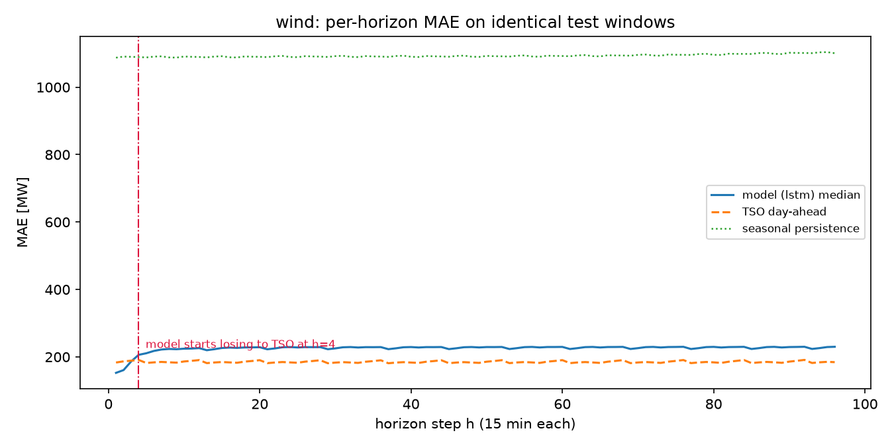

The per-horizon breakdown says the same thing from another angle. Averaging MAE
over all 96 horizon steps hides the structure: step 1 is only 15 min ahead of
issue time, step 96 is 24 h ahead. The model beats Elia only for the first ~1 h
of the horizon, where recent measurements dominate, then runs flat and parallel
above Elia's curve for the remaining 23 h.

**Conclusion: solar and load were data-limited; wind is information-limited.**
Post-processing an NWP-based forecast with power history and calendar features
alone extracts what is extractable — the residual is genuine weather
uncertainty, which is simply not present in the electricity time series. The
next lever was therefore numerical weather prediction (NWP) features — NWP is
a physics simulation of the atmosphere, integrated forward from observed
initial conditions on a supercomputer; its outputs (future wind speed,
radiation, temperature) are consumed here as model inputs. A falsifiable
expectation was recorded in advance: *if NWP is genuinely used, wind MAE
should start varying with the period the way Elia's does, instead of sitting
at its ~225 MW floor.*

#### The recorded prediction failed — and the failure is the finding

With Elia's forecast still in the inputs, adding NWP changed nothing. Nine
runs (3 targets × 3 fine-tuning settings, ~2,700–2,900 training windows)
delivered the NWP channels to the model — the future-covariate channel counts
in the saved checkpoints confirm the features genuinely reached the tensors.
One of the three settings freezes the new NWP weights at zero, which makes
that model numerically identical to one without the feature: a built-in
control run. Wind landed at 193.49 / 194.15 / 193.31 MW across the three
settings — the zero-frozen control included — a 0.4% spread, against
run-to-run seed noise of roughly 10% at this training size. The prediction
was **not met**: wind MAE did not start tracking the period; it did not move
at all. A separate run with the NWP columns deleted outright scored 192.56
against the zero-frozen control's 193.31 — freezing the feature to zero and
deleting it give the same answer.

**The mechanism**: Elia's day-ahead forecast is itself an NWP product —
weather forecasts already passed through power curves, unit availability and
site aggregation. Raw gridded weather at three coordinates is a
worse-processed version of information the model already had. Redundant, not
additive. A prediction written down before the experiment, that then failed,
plus the reason it failed, says more about what this model actually does than
any success metric would have.

#### Same feature, opposite verdict: −75% once the TSO input is removed

The standalone line asks a different question: how good can a forecaster be
that consumes **no other party's forecast** — only public weather data and
its own measurement history? That is the transferable configuration (nothing
Elia-specific left in the inputs), and its honest baseline is persistence,
not Elia.

Two runs form a controlled pair: identical 2,724 training windows, identical
model, identical split — the **only** difference is the NWP channels. The
honesty-critical variable is *lead time*: how far in advance a forecast was
issued. A day-ahead market closes around noon on the day before delivery, so
an operationally usable forecast needs up to ~37 h of lead. The headline
numbers use the archive's fixed **48 h lead** (`previous_day2`), which is
available before any day-ahead gate closure. Test MAE in MW, median of 3
seeds with the min–max range in brackets:

| Target | no NWP | + NWP, 48 h lead | change |
|--------|-------:|-----------------:|-------:|
| Wind   | 1381.87 † | **341.62** (338.07–357.28) | **−75.3%** |
| Solar  | 179.93 (174.79–196.68) | **162.68** (160.33–171.09) | −9.6% |
| Load   | 479.31 (454.79–482.78) | 462.99 (431.13–468.83) | not demonstrated |

† the no-NWP wind baseline is a single seed — its two sibling seeds were
never run. The 75% gap is far beyond the ~15% threshold under which the
multi-seed protocol (below) allows a single-seed comparison, but the baseline
is one draw and this table must not imply otherwise.

- **Wind**: the same feature that was worth 0% with Elia's forecast present
  is worth −75.3% without it — the question was never "is NWP useful" but
  "given everything else in the input, how much information does NWP still
  carry".
- **Solar**'s −9.6% is small but clean: the seed ranges do not overlap, so
  every 48 h-lead draw beats every no-NWP draw.
- **Load**: the ranges overlap. The honest statement is "no demonstrable
  benefit at a legal lead", not "small benefit".
- A 24 h rolling-lead archive (`previous_day1`) would give wind 314.97. The
  48 h number was chosen as the headline at a **measured cost of +8.5%**
  (314.97 → 341.62; the seed ranges are disjoint, so the cost is real rather
  than noise). Paying 8.5% buys a claim that needs no defending: for the late
  hours of the delivery day, the 24 h product is issued *after* a day-ahead
  market has already closed.

#### Why these numbers are credible

Three sanity checks, none of which a bug or a data leak has any reason to
reproduce:

1. **The gain ordering is physically determined**: wind ≫ solar > load ≈ 0
   (−75.3% / −9.6% / not demonstrated). Wind power is set almost entirely by
   future wind speed, and nothing in the power history substitutes for it;
   solar's sun-geometry component is already supplied by the calendar
   features, so NWP only adds the cloud term; load barely depends on weather.
2. **The no-NWP wind run fails in the right way**: its validation loss never
   improved after initialisation (best epoch 0). At 2,724 windows with no
   weather information there is nothing learnable in day-ahead wind — the
   model ends up worse than persistence.
3. **For wind, weather beats data volume**: the full-history no-NWP model
   (17,847 windows) scores 702.96; the NWP model reaches 341.62 on 1/6.5 of
   the data. For solar and load the opposite holds — full history wins —
   consistent with those targets being calendar-driven rather than
   weather-driven.

Two further checks closed off the alternative explanations:

- **The 48 h radiation data is not degraded.** The solar gap between the two
  lead times could have been misread as "48 h radiation forecasts are
  unusable". Measured directly on the test period, the archived radiation
  correlates with measured solar output at 0.810 for the 48 h lead vs 0.780
  for the 24 h lead — the longer-lead data is, if anything, the
  better-correlated one. The gap is seed noise.
- **The archive limit was probed, not assumed.** The NWP training set is
  capped at 2,724 windows because the Open-Meteo forecast archive begins
  2024-02. The one documented multi-year alternative (JMA's global model,
  archived from 2018) was probed with sample days in 2021–2023 *and a 2024
  control*: hub-height wind speed and shortwave radiation come back null
  **even in the 2024 control**, so this is a missing-variable limit of that
  model, not an archive-depth limit — extending history that way would mean
  training on 10 m wind with no radiation at all. Closed, and closed cleanly.

**The measurement protocol behind the tables**: at ~2,700 training windows,
re-running the same configuration with a different random seed (the integer
that fixes weight initialisation and batch shuffling) moves MAE by roughly
10%. Every "A beats B" claim above therefore rests on ≥3 seeds and is
reported as a median with its full min–max range, unless the observed gap
exceeds ~15%. Applying this protocol retroactively **retracted two
conclusions this project had already written down** (both about which
training-window length wind and solar "prefer"; the observed gaps of 7.0%
and 0.6% were inside single-seed noise). The protocol serves the statistical
validity of a *comparison* — it is explicitly not reproducibility work;
bit-level run-to-run repeatability remains a non-goal of this project.

### Architecture: PatchTST vs LSTM, and what it took to measure it

Does a transformer beat the seq2seq LSTM on this data? The question turned out
to be unanswerable with the instrument the project had, and repairing the
instrument produced two results worth more than the comparison itself.

**The problem.** Re-running the standalone LSTM baseline with three seeds
instead of one gave a best-to-worst spread of 10.2% on wind, 7.7% on solar and
12.2% on load. The expected architecture effect is a few percent. A few percent
cannot be read off an instrument whose own scatter is ten.

**What did not fix it: more data.** At ~2,700 training windows the spread had
measured 0.95–19.16% across eight arms; at 17,847 windows it is 7.7–12.2%.
6.5× the training data did not reduce it.

**What did.** The validation set — the 372 windows on which early stopping and
best-checkpoint selection happen — never grew with the training set. Widening it
from one month to four (1,476 windows, costing 6% of the training data) cut
wind's spread from 10.2% to **1.7%** while moving the median by 0.4%. The
variance was in model *selection*, not in what the models learned. Two runs
whose validation losses differ by 0.04% had differed by 8.8% on test.

It is not free. A four-month validation window is more summer-weighted while the
test period is November–December, and the cost lands in proportion to how
calendar-driven a target is: wind, where the calendar explains ~21% of the
variance, gains almost freely; load is helped; solar, at 79.8%, gets *worse*
(7.7% → 11.6%). Solar's architecture verdict carries that caveat.

**The comparison.** Three seeds per architecture on identical windows, learning
rates selected per architecture on validation only — all differences turned out
to be inside seed noise, so the finding there is that the default was *not*
disadvantaging the transformer. Median with min–max range, test MAE in MW:

| Target | LSTM | PatchTST | Verdict |
|--------|------|----------|---------|
| Wind  | **699.95** (688.94–700.97) | 724.28 (716.23–748.39) | LSTM, ranges disjoint |
| Solar | **136.44** (133.00–148.86) | 150.35 (145.29–155.02) | LSTM by 10.2%, ranges overlap marginally |
| Load  | 312.59 (299.38–324.36) | **299.81** (288.96–307.10) | indistinguishable |

The LSTM's *worst* wind draw beats PatchTST's *best* by 15.26 MW — every LSTM
seed beats every PatchTST seed. **536,652 parameters lose to 38,531**: the
fourth time in this project that more trainable parameters have done worse at
this data scale, and the first measured with disjoint three-seed ranges rather
than inferred. No run was cut short by its epoch cap, so "undertrained" is ruled
out as an explanation.

One thing PatchTST is measurably better at: interval calibration on load, where
its three coverage values are 0.796 / 0.799 / 0.805 against a nominal 0.80,
against the LSTM's 0.766 / 0.794 / 0.811.

**Features versus architecture — both halves measured here, not cited:**

> On identical windows, replacing the seq2seq LSTM with PatchTST **costs 3.5%**
> on wind. On identical windows one-sixth the size, adding a freely available
> 48-hour-lead weather forecast is worth **−75.3%**. Features set the ceiling;
> architecture determines how close you get to it.

Each of those two comparisons is internally controlled at its own training-set
size. The cross-scale figure — the best NWP model at 2,724 windows against the
best no-NWP model at 17,847 — is **−51.4%**, and the three numbers must not be
conflated.

#### The scaling curve, and why the transformer lost

Both architectures at 10 / 25 / 50 / 100% of the training windows, subsampled
uniformly across the whole training period, three seeds per point. Wind:

| Training windows | LSTM | PatchTST |
|---:|---|---|
| 1,674 | 832.30 | **773.11** — 7.1% better |
| 4,185 | **744.96** | 754.36 |
| 8,371 | **715.67** | 742.15 |
| 16,743 | **699.95** | 724.28 — 3.5% worse, ranges disjoint |

**The curves cross.** The same crossing appears on solar (PatchTST 7.4% better
at 1,709 windows, 10.2% worse at 17,094). On load PatchTST wins at every size,
but its lead shrinks monotonically from 16.2% to 4.1%.

The mechanism is slope, not quality. From the 10% point to the 100% point the
LSTM improves by **15.9%** (wind), **20.4%** (solar) and **21.1%** (load);
PatchTST improves by 6.3%, 5.2% and 9.8% — between 2.2× and 3.9× less.
**PatchTST stops improving at roughly four thousand windows; the LSTM is still
descending at seventeen thousand.**

So the verdict is not "the transformer is a worse model of this problem" — at
1,674 windows it is the better one on all three targets:

> The two architectures differ less in quality than in *where they stop
> improving*, and this dataset sits past PatchTST's stopping point and before
> the LSTM's.

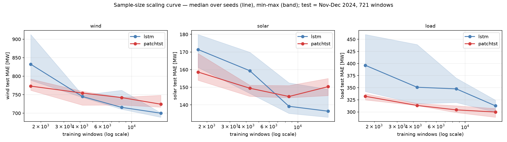

The x axis counts windows, and at full density two consecutive windows share 92%
of their 24-hour context (a window opens every 2 hours). This curve therefore
measures **denser sampling of 2020-07 → 2024-07**, not more years — a flat
segment means further density stops paying, not that further data would.

**One claim this curve corrected.** Phase 0 measured that 5.4× the training
period moved wind MAE by 0.08%, and that has been quoted since as "wind is
information-limited, not sample-limited". This curve measures −15.9% over a
comparable range of training-set sizes. The two are not in conflict: Phase 0's
ablation had **Elia's day-ahead forecast in the input**; this curve has no TSO
input at all. With Elia's forecast available, extra history adds nothing for
wind — the forecast already carries what the history would have to be mined for.
Remove it, and more windows help substantially. This is structurally the same
statement as the project's headline NWP result — **what a resource is worth
depends on what else is already in the input** — now shown to hold for training
data as well as for weather.

#### Known limitations

- **Interval calibration is poor, and the legal lead makes it worse.**
  *coverage_80* is the fraction of true values that fall inside the model's
  80% prediction interval; the ideal is 0.80, and lower means the intervals
  are too narrow. Medians of three seeds for the standalone NWP models: wind
  0.773 (24 h lead) → 0.722 (48 h lead); solar daylight coverage 0.762 →
  0.680 (seed 42 only); load 0.612 → 0.619. Point forecasts are usable; the
  prediction intervals are not yet trustworthy.
- **For solar, only daylight coverage is meaningful.** At night solar output
  is identically zero and almost any interval covers a zero target, so the
  all-hours figure (0.896–0.919 here) overstates calibration by roughly 15
  percentage points. Solar coverage in this README is daylight-only.
- **The test set is one season.** Nov–Dec 2024, 721 windows. Every forecast
  number in this project describes late-autumn/winter performance; nothing
  here supports a claim about summer, and no seasonal comparison is possible
  without changing the frozen split.
- **The dispatch and RL results below were produced with the original
  single-year LSTM forecasts.** The newer forecasters were later fed through
  the same dispatch as alternative input tiers (see "What is forecast accuracy
  worth to dispatch?"): on realised cost they are indistinguishable from the
  original LSTM, so re-basing the published comparison on them would not
  change its conclusions.
- The standalone forecaster's wind error is ~1.85× Elia's (341.62 vs 185.08).
  The honest framing is not that it beats the TSO — it does not — but that it
  uses **none of Elia's outputs**: only public weather data and its own
  history.

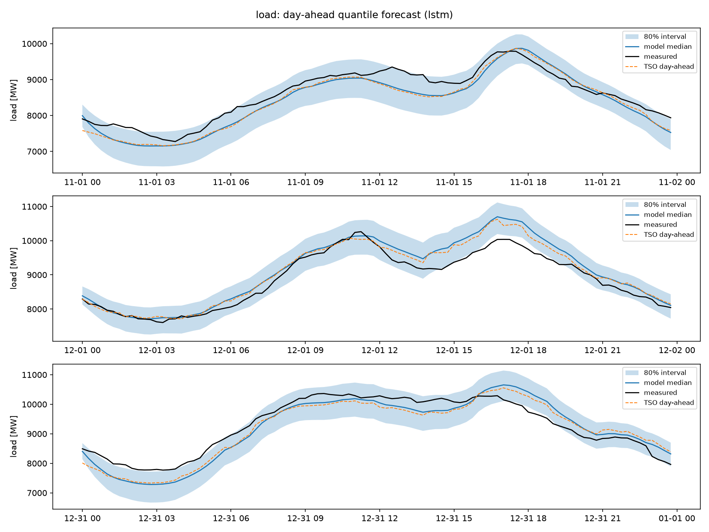

### Day-ahead multi-objective dispatch (NSGA-III; cost / CO₂ emissions / grid peak)

> **Note**: the numbers in this section and the next were produced with the
> *single-year* LSTM forecasts (`models/*_lstm/`, not the improved
> `*_lstm_multiyear` runs) and are kept as published. How much a more accurate
> forecast is actually worth to this dispatch has since been **measured** — see
> "What is forecast accuracy worth to dispatch?" below; the short answer is
> that on cost, it is worth almost nothing.

The national-scale forecasts are **downscaled** to a notional microgrid (peak load 4 MW, wind capacity 2 MW, solar capacity 3 MW; scaling factors derived from each series' maximum, defined in `configs/system/default.yaml`). For a given day (96 × 15 min) the day-ahead Pareto front is solved over three objectives: **operating cost / CO₂ emissions / grid peak power**. Decision variables are the per-step outputs of the micro gas turbine and the battery, `x = [P_mt(96), P_bat(96)]` (`P_bat > 0` discharging, `< 0` charging); the grid tie-line power is the **slack** of the power balance and never enters the decision vector. SoC bounds, terminal SoC (intra-day energy neutrality), tie-line ±3 MW and turbine ramp ±0.5 MW/step enter pymoo's **constraint vector G** (not folded into penalty terms).

**Objectives are pluggable**: each objective is a pure function (`src/microgrid/optimize/objectives.py`) selected by the `objectives: [cost, co2, peak_grid]` list in `configs/optimize/default.yaml`; the pymoo problem's `n_obj` is simply the list length — removing an entry yields a valid lower-dimensional run with **zero code change** (`optimize.objectives=[cost,co2]` degrades to two objectives). Devices, costs and emissions are all driven by `system.yaml`: quadratic turbine fuel cost + emission factor, asymmetric battery charge/discharge efficiency + throughput degradation, time-of-use buy/sell tariffs, carbon counted only on **imported** energy; `peak_grid = max_t |P_grid(t)|` (peak shaving, relieving stress at the point of common coupling — orthogonal to money/carbon, hence its own dimension).

**Why three objectives?** The core of NSGA-III is Das–Dennis **reference directions**: they tile the objective simplex uniformly and use reference points in environmental selection to keep the front evenly distributed in **≥3 dimensions** — precisely its value over NSGA-II. With two objectives, crowding distance (NSGA-II) suffices and NSGA-III has no advantage; this project therefore treats the three-objective case (cost/CO₂/peak) as the primary scenario. Reference-direction density adapts to the number of objectives (`ref_partitions` configured per objective count; three objectives default to `p=12` → 91 directions). To help the population escape the thin feasible manifold of the terminal-SoC equality, an **energy-neutrality repair operator** (rescaling charge/discharge energy into balance) and heuristic warm starts were added, with an external archive collecting feasible non-dominated solutions across generations.

Finally, **entropy-weighted TOPSIS** picks the compromise point: each objective is min-max normalised to [0,1] **over the front** before computing entropy weights (this prevents weight collapse when cost — large in absolute baseline but small in relative range — is mistaken for "nearly constant"); the method generalises naturally to m objectives. The **knee point** (maximum perpendicular distance to the line joining the front's endpoints) has clear geometric meaning only with two objectives, so it is reported only for two-objective runs and noted in `solution.json`. The full `python scripts/optimize_dispatch.py optimize.day=2024-11-15` run takes ~15 s on CPU.

For 2024-11-15 (wind/solar/load taken as their LSTM median forecasts): the front contains **650 non-dominated solutions**, cost ≈ 7.3k–8.0k EUR/day, CO₂ 21–29 t/day, grid peak 1.6–3.0 MW, with clear trade-offs (cheaper ⇒ more carbon, higher peak). Normalised entropy weights come out as cost 0.40 / CO₂ 0.31 / peak 0.28 (comparable magnitudes, fairly balanced weights), and TOPSIS selects an **interior compromise point: ≈ 7,396 EUR, ≈ 25.9 tCO₂, ≈ 2.04 MW grid peak** (red star in each panel below).

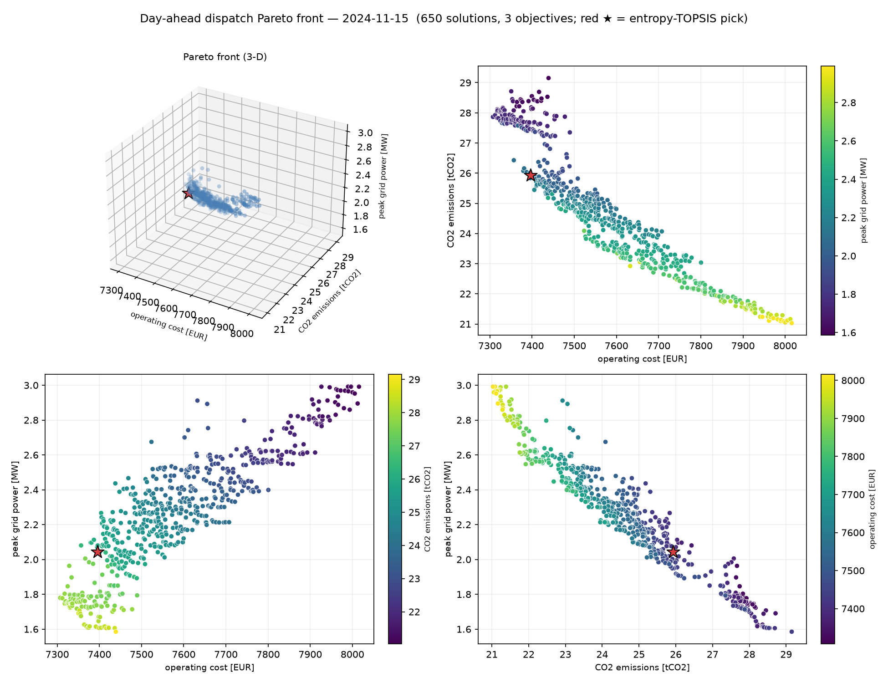

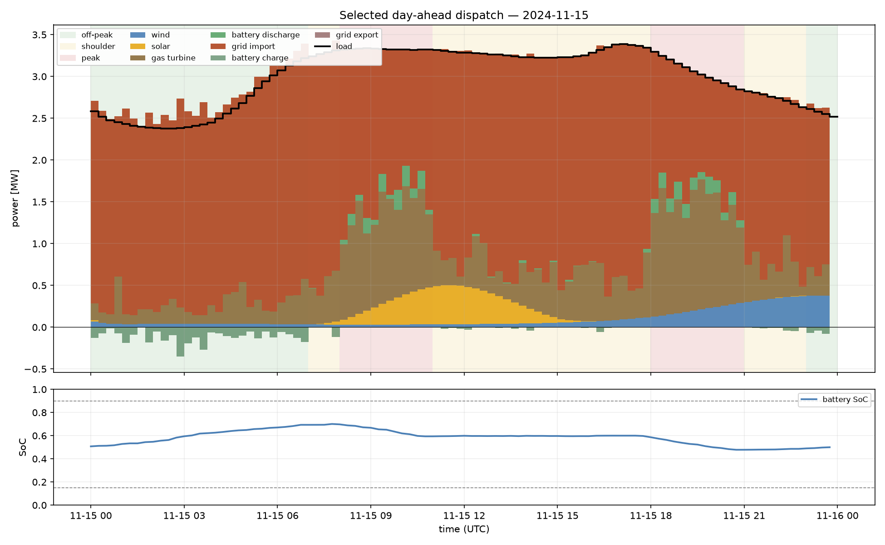

> **On net export**: after scaling, wind + solar capacity (2 + 3 = 5 MW) exceeds peak load (4 MW), so high-penetration days should see net export to the grid (sell price = 0.4 × buy price, no carbon credit, tie-line limited to ±3 MW — all implemented and unit-tested). But the Nov–Dec test window is winter with near-zero solar: in the measured data renewable output never exceeds load at any step (the whole year offers only ~0.85 MW of peak margin), so dispatch is import-dominated. Scaling parameters were deliberately **not** tuned to manufacture or avoid export; the export path triggers naturally on high-solar summer days.

### RL dispatch policy (SAC, closed-loop) vs NSGA-III and a rule-based baseline

Day-ahead dispatch is recast as a **sequential decision** problem: one day of 96 × 15 min is an episode; at each step the agent outputs turbine and battery power `[P_mt, P_bat]` (actions ∈ [-1,1], affinely mapped to device bounds); the grid tie-line remains the **derived slack** of the power balance.

- **Environment** (`src/microgrid/rl/env.py`, passes the official `gymnasium` `env_checker`): the physics **fully reuses** `system.py` — per-step primitives (`soc_step`/`fuel_cost_step`/…) were added for the closed loop, with unit tests asserting that "step-wise sums == the original vectorised whole-day functions", i.e. the environment introduces no new physics (the source of physics stays unique). **Feasibility via projection, not penalties**: actions are first clipped into the ramp-feasible interval (P_mt) and the SoC-feasible interval (P_bat), with projection magnitude logged as a diagnostic. Observations (all normalised) include SoC, sinusoidal within-day step encoding, current measured wind/solar/load, the next 2 h of LSTM median forecasts, current/next buy price, and the remaining-steps fraction.
- **Reward**: `-(Δcost + carbon_price·ΔCO₂)/scale` accumulated per step, plus a terminal `-(w_soc·|SoC_T−SoC_0| + w_peak·grid_peak)` — so that all three comparison metrics (cost / CO₂ / peak) exert training pressure. **A non-trivial tuning lesson**: `w_soc` must be **greater than** the arbitrage value of draining the battery's initial charge (~266 EUR for a full discharge), otherwise the policy rationally empties the battery at day's end to cut cost — unfair cheating against the energy-neutral NSGA/rule baselines (symptom: `soc_dev` stuck at 0.35). Raising `w_soc` from 500 to 1500 restored near energy-neutrality (`soc_dev ≈ 0.03`).
- **SAC** (Soft Actor-Critic — an off-policy RL algorithm for continuous actions that maximises return plus policy entropy to sustain exploration; `stable-baselines3` implementation) is trained on the forecast training period (Jan–Sep), validated on October, and **never touches** Nov–Dec until the final comparison. Training is **time-boxed and resumable** (replay buffer + checkpoints saved, learning curves flushed incrementally), converging in ~130k steps on CPU; validation cost 5017 → 4826 EUR. PPO is a documented fallback switch (`rl=ppo`).

**Three-way comparison (`scripts/compare_dispatch.py`, 61 test days, Nov–Dec)**: all three methods receive the **same LSTM median forecasts** and are executed against **measured ground truth** through the same physical path (`rollout.simulate`) — NSGA-III+TOPSIS re-optimises each day (full budget, ~10 s/day) and then runs **open-loop**; the RL policy rolls **closed-loop** (observing ground truth as it decides); the rule baseline runs closed-loop.

| Method | Realised cost (EUR) | CO₂ (t) | Grid peak (MW) | Terminal SoC dev. | Tie-line violations (steps/day) | Decision latency |
|--------|:---:|:---:|:---:|:---:|:---:|:---:|
| Rule baseline | 5317 | **16.9** | 2.97 | 0.113 | 4.6 | 0.04 ms/step |
| NSGA-III+TOPSIS | 5456 | 18.6 | **1.90** | **0.00** | **0.0** | 10.3 s/day (solve) |
| **RL (SAC)** | **5220** | 20.4 | 2.57 | 0.05 | 1.6 | 0.37 ms/step |

> **Cost differences require paired statistics, not just means**: single-day cost varies a lot from day to day (σ ≈ ±1,700 EUR for every method), dwarfing the ~200 EUR gaps between method means — comparing means alone cannot establish "who is cheaper". Pairing the methods **on the same day** and differencing cancels the day effect: **RL vs rule baseline** −98 ± **212** EUR/day, RL cheaper on **72%** of the 61 days; **RL vs NSGA** −236 ± 181 EUR/day, RL cheaper on **87%** of days; NSGA vs rule baseline +138 ± 115 EUR/day (NSGA cheaper on only 8% of days). The paired σ (±180–212) is far below the single-method day-to-day variance (±1,700), so RL's cost advantage is statistically supported rather than drowned in variance.

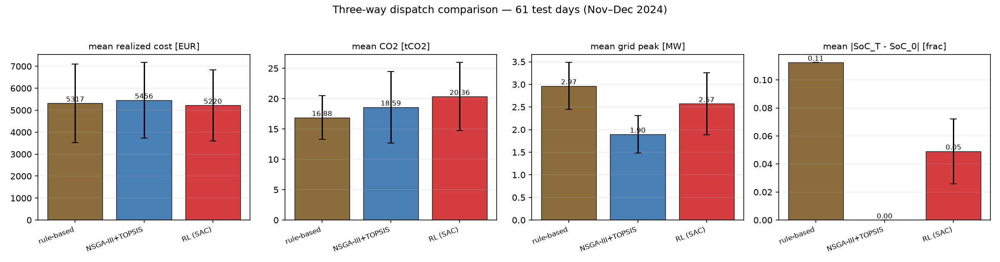

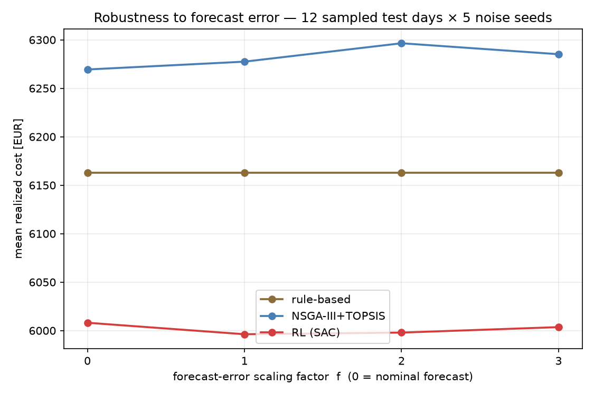

**The honest conclusion — no method dominates; there is a clear division of labour**:
- **RL is the cheapest, fastest and most robust to forecast error**: mean realised cost 1.8% below the rule baseline and 4.3% below the NSGA compromise point, and — paired to the same day — cheaper on **72% / 87%** of the 61 days respectively (statistics in the table note above); after training, a decision takes only 0.37 ms, enabling a real-time closed loop; amplifying forecast error 0→3× (figure above right) barely moves RL's cost (~6,000 EUR, lowest and flattest), because it observes ground truth closed-loop instead of relying on an offline plan. **The price**: highest CO₂ (carbon price set at only 30 EUR/t, so the reward skews toward saving money), a black box, and it needs training.
- **NSGA-III has the hardest constraint guarantees and the best peak**: it explicitly optimises the whole-day Pareto front, hits terminal SoC exactly zero, zero tie-line violations, and the lowest grid peak (1.90 MW) — an auditable day-ahead offline plan. **The price**: ~10 s per day to solve and **open-loop** execution — the worse the forecast, the more it suffers (the blue curve rises monotonically with error), giving the highest overall cost.
- **The rule baseline has the lowest CO₂ and is training-free and interpretable**, but the worst peak shaving (2.97 MW, close to the tie-line limit), the largest terminal SoC drift and the most violations; since it ignores forecasts, its robustness curve is a flat line.

In one line: **offline with hard-constraint guarantees → NSGA-III; online, real-time and robust to forecast error → RL; a minimal interpretable floor → rule baseline.** The value is not "RL wins" but an honest, reproducible comparison of all three on the same physics engine and the same forecasts.

### What is forecast accuracy worth to dispatch? (the forecast-value transfer function)

Everything above treats the forecast as a given input. This section measures
the converse: if the forecast were better — or perfect — what would dispatch
actually gain? The complete record is
[docs/experiments/08-forecast-value-log.md](docs/experiments/08-forecast-value-log.md)
(its §11 is the synthesis); machine-readable aggregates sit in
`models/comparison/block_b/`.

**Method.** The same NSGA-III dispatch is fed forecasts of controlled quality
over the same 61 winter test days. One synthetic knob is **residual scaling**:
per day, the real forecast error is shrunk or stretched by a factor γ — γ=0 is
perfect foresight (the measured series used as the forecast, an upper bound,
not a model), γ=1 the operational forecast, γ=2 doubles the error while keeping
its hour-to-hour shape. The white-noise sweep above is kept as a second,
separately-labelled axis. On top of both, four **real forecast tiers** — Elia's
day-ahead, the standalone NWP forecaster, the standalone no-NWP model, seasonal
persistence ("tomorrow = same time yesterday") — are placed at their MAE
measured on exactly these 61 days. Because the genetic optimiser's own random
seed also moves the answer, **every point runs at three optimiser seeds** and a
difference only counts when the three-seed min–max ranges do not overlap; the
measured seed noise at the nominal forecast is **28.46 EUR/day**. (These runs
are all from one machine; the task-04 tables above are the earlier published
record from another, and the two are never mixed in one table — a same-seed
change of CPU alone was measured to move the NSGA-III mean by 0.092%, about a
fifth of the entire white-noise effect.)

**The transfer function** (61 Nov–Dec 2024 days, one system configuration,
deterministic time-of-use prices):

- **Perfect foresight is worth ≈ 0 EUR/day on cost.** Replacing the
  operational forecast with the measured truth moves the median cost by
  +17.94 EUR/day — *upward*, and inside the 28.46 EUR/day optimiser noise.
  The one channel that clears the noise is the tie-line peak: −0.033 MW,
  ranges disjoint.
- **Degrading the forecast has a measured price in both.** Doubling the real
  error: +24.67 EUR/day and +0.097 MW of peak, both range-disjoint. Tripling
  white noise: +40.64 EUR/day (+0.65%) and +0.219 MW (+10.6%).
- **Cost prices the error's *structure*; peak prices its *size*.** At matched
  net-load MAE, real hours-correlated error costs ≈ 560 EUR/day per MW of MAE
  against white noise's ≈ 220 — a factor of 2.5, ranges disjoint — while the
  two peak curves lie on top of each other. A scalar MAE is a sufficient
  x-axis for peak and an insufficient one for cost.
- **Among the real tiers, only doing no forecasting at all costs money.**
  Seasonal persistence — at 3.7× the operational MAE — is the only tier
  range-disjoint on cost (+36.74 EUR/day) and the only one whose plans brush
  the ±3 MW tie limit; Elia's day-ahead and both standalone models are
  indistinguishable from the operational LSTM on cost. The whole span from
  "no forecasting" to the operational forecaster is worth ≈ 37 EUR/day
  (0.7% of realised cost) and ≈ 0.14 MW of peak.

In one sentence: **on this configuration, going from the current forecast to a
perfect one is worth at most ≈ 0 EUR/day and 0.033 MW of tie-line peak — most
of what forecasting buys is already banked by any reasonable forecaster, and it
shows up in peak and tie-limit compliance, not on the bill.** The mechanism is
measured, not guessed: the tariff is a fixed hour-of-day lookup, so the
arbitrage schedule needs no forecast, and the ≈ 0.15 MW net-load error is small
against every actuator (0.5 MW/step turbine ramp, ±1 MW battery, ±3 MW tie).
This is the negative result the roadmap explicitly priced in — now with its
upper bound measured rather than assumed.

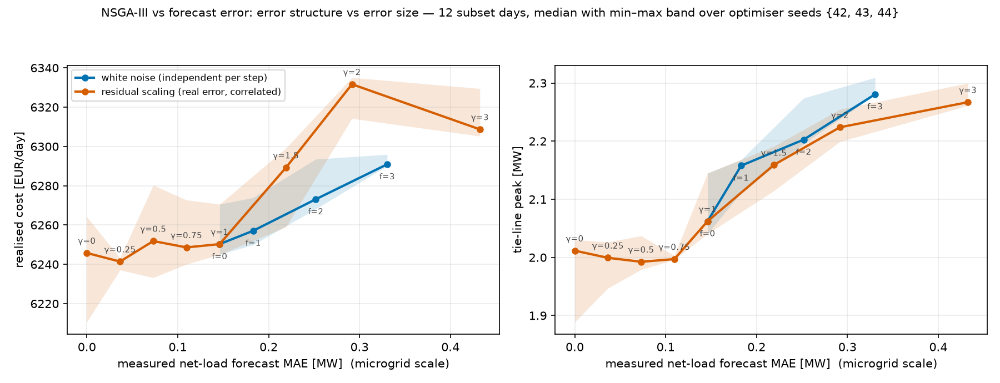

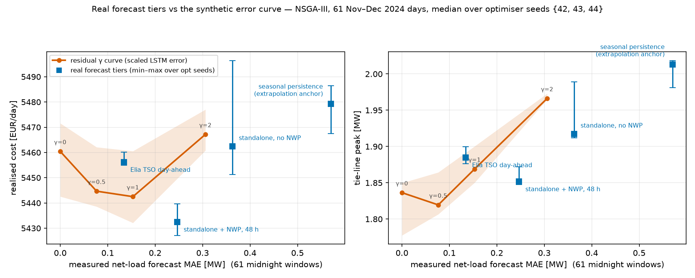

A methodological footnote: at a single optimiser seed the white-noise cost
curve is non-monotone (f=3 lands below f=2 — the published task-04 curve shows
the same inversion), while the three-seed median curve is monotone. The
≥3-seed protocol this project adopted for forecasting turned out to change the
shape of a dispatch curve as well.

### How far is the heuristic from the true optimum? (the MILP optimality gap)

Task 08 asked what a better forecast is worth to this dispatch; the natural
next question is what a better *optimiser* would be worth. The complete record
is [docs/experiments/09-milp-gap-log.md](docs/experiments/09-milp-gap-log.md)
(its §5 is the synthesis); machine-readable aggregates sit in
`models/comparison/block_c/`.

**Method.** For this configuration the planning problem NSGA-III searches is
exactly solvable: every objective and constraint term is convex and
representable in a linear program (LP — an optimisation problem whose
objective and constraints are all linear, which solvers can optimise to a
*provable* global optimum). The single genuine non-linearity, the turbine's
quadratic fuel curve, is under-estimated by tangent lines, so the LP optimum
is a certified **lower bound** on the true optimum — the safe direction,
since it can only overstate the heuristic's gap, never flatter it. Solved
with HiGHS (inside SciPy, already a dependency; a median 22.1 ms per day
against NSGA-III's 3.49 s), with the equivalence to the real problem
unit-tested term by term — objective, every constraint row, the variable
bounds (added after mutation testing showed them uncovered), and a dominance
test against sampled feasible plans. Every solve carries a self-certificate,
and the bound pair brackets the optimum to at worst 0.054 EUR/day. No integer
variable was needed (the turbine is always on, so there is no on/off
decision). Every gap is **planned-versus-planned**: both plans are scored by
the same cost function on the same forecast; realised costs never enter.

**The gap, on the 61 winter test days, at three optimiser seeds** (median with
min–max range across seeds; the planned-cost optimiser-seed spread — the noise
floor — is ~19–30 EUR/day wide):

- The dispatched NSGA-III+TOPSIS plan costs **15.1% [15.0, 15.4] more** than
  the deterministic optimum: 713.70 EUR/day [702.32, 738.77].
- A second LP, constrained to the dispatched plan's own CO₂ and peak, splits
  that excess exactly (the identity is asserted in code per day):
  **452.74 EUR/day [449.26, 457.69] (9.0%) is the optimiser falling short**
  of the cheapest plan achieving the same CO₂ and peak, and
  **237.43 EUR/day [222.31, 246.71] (5.0%) is the price of the
  three-objective compromise** itself — roughly two thirds recoverable by
  searching better, one third the cost of the trade-off the project chose,
  which no amount of compute recovers.
- The front's cheapest point (the optimality gap proper) sits
  646.94 EUR/day [636.29, 649.20] above the bound — 13.0%, positive on all
  61 days, worst day 2024-11-19 on every seed.

**The caveat that belongs in the same breath.** The cost optimum is not a
plan anyone would dispatch as-is: it pins the tie line at its 3.0 MW limit on
37 of 61 days (mean peak 2.7186 MW vs the dispatched plan's 1.8160) and
carries more CO₂ (21.42 vs 18.93 t/day). The planning problem prices neither
forecast error nor robustness — and NSGA-III's plans execute at 0.00 tie-line
violations per day against the rule baseline's 4.59 and RL's 1.64 (08 log
§4.1). **Part of the gap is therefore paid for in headroom that the objective
function does not value.** How much of it survives contact with the actuals
has since been **measured** — see "Does the proven optimum survive
execution?" below. The NSGA-III budget sweep the gap's size justifies remains
recorded and unstarted.

The LP is a measuring instrument here, not a replacement dispatcher — and not
because of the Pareto front (an ε-constraint scan over CO₂/peak ceilings
would produce a front too, in seconds) but because of the model-class
boundary: add unit commitment, SoC-dependent efficiency, or any non-convex
term to the physics and the LP construction fails, while NSGA-III keeps
running unchanged. One guard for any reader of these numbers: the planned
lower bound (4780.15 EUR/day, on the forecast) and the realised NSGA-III cost
(5442.4993 EUR/day, against the actuals) live on opposite sides of the
forecast/execute boundary — their difference is not a saving and must never
be computed.

### Does the proven optimum survive execution? (the LP-plan execution check)

Task 09 measured how far the dispatched plan sits from the proven optimum *of
the planning problem* and attached a caveat it deliberately did not test:
part of that gap might be buying tie-line headroom the objective function
does not price. This task prices the caveat. The complete record is
[docs/experiments/11-lp-execution-log.md](docs/experiments/11-lp-execution-log.md)
(its §5 is the synthesis); machine-readable aggregates sit in
`models/comparison/block_d/`.

**Method and scope.** Both LP schedules — the unconstrained cost optimum and
the ε-constrained one (the cheapest plan at the dispatched plan's own planned
CO₂ and peak) — are replayed **open-loop against the measured actuals**
through the same simulator that scores every other method, over the same 61
Nov–Dec 2024 days at three optimiser seeds. Everything is
realised-versus-realised; no planned cost appears in any table. Violations
are counted at two thresholds (raw > 0 and material > 1e-6 MW, the solver
feasibility tolerance) because 32/61 LP plans carry a *planned* peak above
the limit by up to 2.3e-7 MW — solver tolerance, not physics; in execution
the two counts turned out identical everywhere, so the artefact is measured
absent rather than assumed away. The replay itself is a physics check: the
projection the simulator applies to infeasible requests stayed at float noise
(1e-15 MW) on all 183 items, so the LP model and the execution physics agree.

> Replayed open-loop against the measured actuals over the same 61 Nov–Dec 2024
> days, the deterministic cost-optimal LP plan realises **4857.2320 EUR/day** —
> 575–603 EUR/day below the dispatched NSGA-III plan (08 log §4.1, quoted) and
> cheaper on 61 of 61 days at every optimiser seed — **but breaks the 3 MW tie
> limit on 33 of those days, at 4.1475 material violation steps per day, 90 % of
> the forecast-free rule baseline's rate, where the dispatched plan breaks it on
> none.** Constrained to the dispatched plan's own planned CO2 and peak, the
> same solver's plan realises 5036.5–5066.2 EUR/day — still 383–396 EUR/day
> cheaper, still on 61 of 61 days at every seed — **while violating on 0–2 days**.
> The 179–209 EUR/day between those two plans is what the three-objective
> compromise costs in execution, and it is what buys 31 of the 33 violating days
> away; the remaining 383–396 EUR/day is optimiser shortfall, and it is bankable
> without spending any of the tie limit.

Four findings behind the headline, each with its scope:

- **The two-thirds/one-third split survives execution.** On the execution
  side (all terms realised, against the same actuals) the optimiser-shortfall
  share of the LP arm's advantage is 65–69 % across the three seeds; task 09
  measured the same share on the planning side (all terms planned, on the
  same forecast) at 63 %. The two ratios are compared; the underlying numbers
  never cross the forecast/execute boundary.
- **The violations sit exactly where the plan had no headroom.** A
  pre-registered prediction, scored: of the 37 days whose LP plan pins the
  tie line at 3.0 MW, 31 violate in execution; of the 24 unpinned days, 2 do.
- **A small systematic asymmetry, bounded and not corrected.** Both LP plans
  end every day with the battery drained to the terminal-SoC floor (0.05 MWh
  down — stored energy is worth money, so the cost optimum spends its whole
  terminal allowance), where the dispatched plan ends at exactly zero
  deviation. Priced at each day's own maximum buy price that is at most
  10.00 EUR/day — inside the 28.46 EUR/day optimiser-seed noise floor and far
  below the 575–603 or 383–396 EUR/day differences — so it cannot explain any
  headline number. Nothing is subtracted on account of it.
- **What opens next, and what it must beat.** The gated tie-limit margin
  sweep (re-solve the LP with a tightened limit until realised violations
  reach zero) is promoted by these results — but the ε arm already
  demonstrates ~390 EUR/day realised at 0–2 violating days, so both that
  sweep and the recorded NSGA-III budget sweep now have the realised ~390
  EUR/day as their target, not task 09's planned 453. (The margin sweep has
  since been run and beat that bar — see the next section.)

### Can one static number make the optimal plan dispatchable? (the tie-line margin)

Task 11 left the project without a dispatchable LP plan: the cost optimum
violates the tie limit on 33 of 61 days, and the ε-constrained arm that fixes
this copies its ceilings off the NSGA-III/TOPSIS plan for that day and seed —
so a 3.49 s/day heuristic sits on its critical path, and it cannot exist
without one. This task asks whether **one static number** does the same job: a
margin δ subtracted from the *planner's* tie limit (the LP plans against
3.0 − δ MW) while the physics and the violation verdict stay at 3.0 MW for
every arm. The complete record is
[docs/experiments/12-tie-margin-log.md](docs/experiments/12-tie-margin-log.md)
(its §5 is the synthesis); machine-readable aggregates sit in
`models/comparison/block_e/`.

**Method and scope.** Six margin values δ ∈ {0 (a reproduction arm), 0.05,
0.10, 0.20, 0.35, 0.50} MW, each an LP plan on the nominal forecast replayed
open-loop against the measured actuals through the same simulator as every
other method — 61 Nov–Dec 2024 days, three optimiser seeds,
realised-versus-realised throughout. The margin arms are deterministic and
seedless; their seed-invariance is proved by an in-run check rather than
sampled, so each is reported once, never as a seed range. Before any
comparison, the batch reproduced all five task-11 arms against the published
block_d record float-exactly (9,150 metric cells), and the δ = 0 arm
reproduced the unconstrained optimum bit-for-bit on all 61 days.

> Tightening only the *planner's* tie limit by a static **δ = 0.35 MW**, while
> the physics and the verdict stay at 3.0 MW, produces the first LP plan in
> this project that is both dispatchable and free-standing: **0 of 61
> violating days** at **4862.74 EUR/day** realised — **173.79–203.51 EUR/day
> cheaper than the ε-constrained arm** at all three optimiser seeds and
> 569–598 EUR/day below the dispatched NSGA-III plan, with no heuristic on
> the critical path, no optimiser seed, and one 22.1 ms solve per day. The
> headroom itself costs **5.51 EUR/day** against the unconstrained cost
> optimum — where the three-objective compromise charged 179–209 EUR/day to
> buy the same 33 violating days away.

The full curve, because the curve is the deliverable and the losing margins
stay in the table (realised cost with its violation columns beside it, as
everywhere in this project):

| δ (MW) | realised cost (EUR/day, 61-day mean) | violation steps/day | violating days |
|---:|---:|---:|---:|
| 0.00 | 4857.2320 | 4.1475 | 33 / 61 |
| 0.05 | 4857.7261 | 3.0492 | 28 / 61 |
| 0.10 | 4858.2718 | 1.6393 | 20 / 61 |
| 0.20 | 4859.5461 | 0.2623 | 6 / 61 |
| **0.35** | **4862.7420** | **0.0000** | **0 / 61** |
| 0.50 | 4867.9800 | 0.0000 | 0 / 61 |

Three findings behind the headline:

- **Executability was the cheap third of what the compromise was buying.**
  The ε arm pays 179–209 EUR/day over the unconstrained optimum and gets 0–2
  violating days; the margin arm pays 5.51 EUR/day and gets 0. The 174–204
  EUR/day difference is what the ε arm's *other* ceilings cost — a CO₂ bound
  the margin arm does not carry, and a peak reservation roughly 0.65 MW
  deeper than executability required. A gated follow-on (the δ × CO₂ cross)
  is promoted to split that price into its two parts; it is priced and
  recorded, not run.
- **The knee sat where the overshoot said it would.** The pre-run audit
  measured the unconstrained plan's worst single-step overshoot at 0.2753 MW;
  0.35 is the smallest grid value above it, and all four pre-registered
  predictions (knee position, the win over the ε arm, monotone cost and
  violation curves, feasibility everywhere) held. The result is not
  knife-edged: even overshooting the knee to δ = 0.50 keeps the arm 168+
  EUR/day ahead of the ε arm.
- **The price curve is shallow because the margin binds on under half the
  days** (28–38 of 61 across the grid): on the others the plan never wanted
  the headroom, so reserving it costs nothing.

This is the baseline the receding-horizon controller (roadmap C1) must beat:
dynamic intraday correction that cannot beat a 5.51 EUR/day static insurance
premium is not worth its complexity — a falsifiable bar, by construction.

### SQL data layer + data agent (natural-language querying)

The pipeline's outputs (measurements, forecasts, dispatch experiments), previously scattered across parquet/JSON files, are loaded into a **PostgreSQL relational layer**: 5 tables, 1,210,642 rows (raw_measurements 578,326 + forecasts 631,496 + dispatch_results 723 + dispatch_solution 1 + dispatch_schedule 96), idempotent bulk loading (COPY into a staging table + `ON CONFLICT DO UPDATE`), business `COMMENT`s on every table and column, plus 8 analysis queries with business conclusions (`sql/analysis/`). The layer covers the full 2019-01-01 – 2024-12-31 history; an absent measurement is an absent row, never a NULL (the loader reports the per-series dropped counts), and Elia's solar series only starts on 2020-06-30, so cross-series queries must mind the coverage.

On top of the database sits an **LLM data agent** (`scripts/ask_data.py`): through three tools — `list_tables / get_schema / run_query` — the model autonomously explores the schema (the column comments double as its semantic annotations), writes and executes SQL, self-corrects after errors, and answers with cited numbers in the language of the question.

```bash
python scripts/ask_data.py --show-trace "Which month of 2024 had the largest wind forecast error?"
```

A real traced run (question asked in Chinese — "Which wind forecast is more accurate, LSTM or the TSO?"; DeepSeek backend; the full trace of a single run):

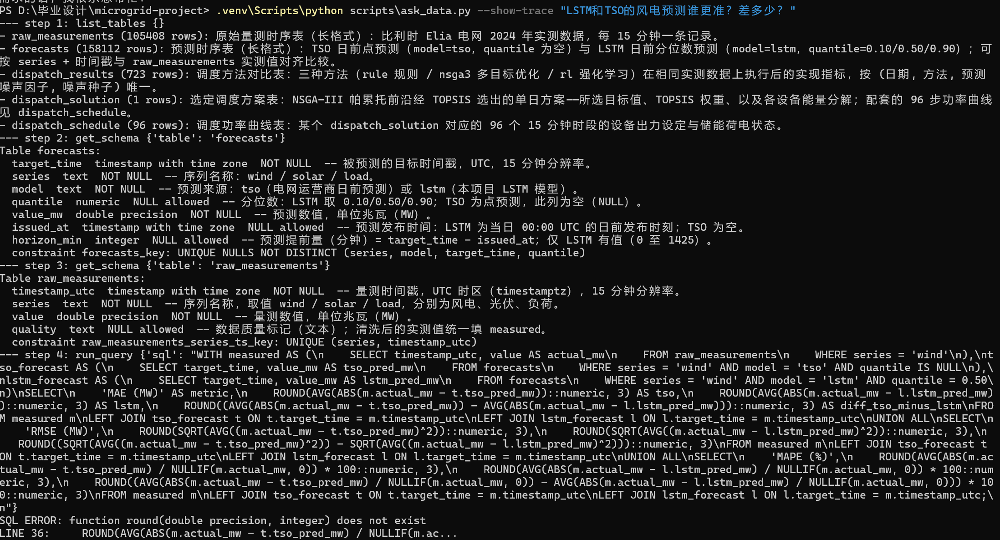

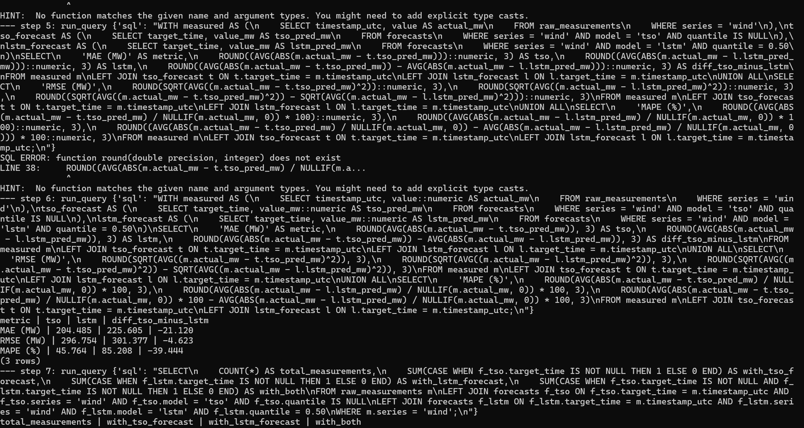

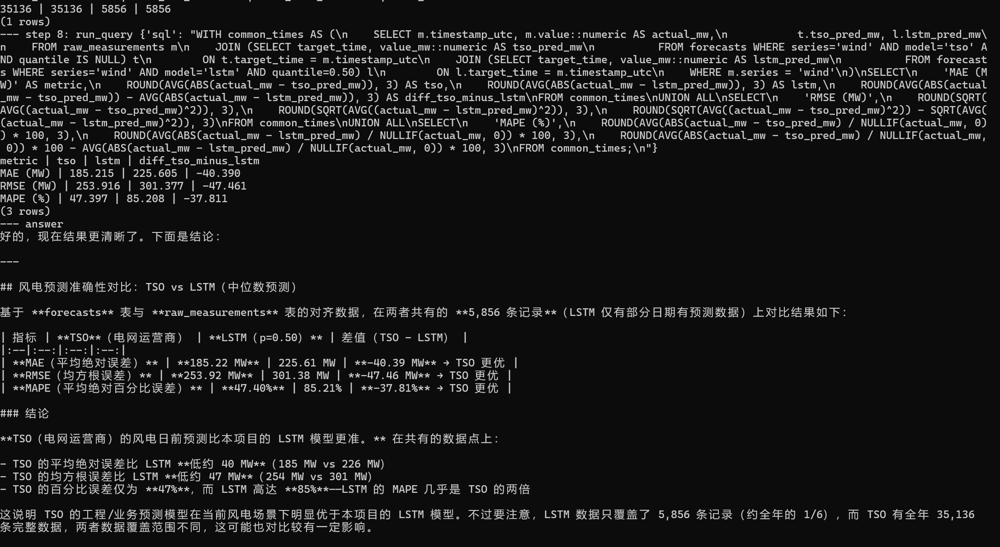

Steps 2 and 3 happened **without any human prompting**: the first LEFT JOIN produced a TSO MAE of 204.5 MW, diluted by full-year data; the agent checked the coverage itself and corrected the comparison basis. (The trace predates task S3's full-history load: the row counts in the screenshots reflect the then-2024-only layer — the TSO series now spans 2019–2024, which makes exactly this kind of coverage check matter more, not less.)

Safety is **belt-and-braces**: a pure-function SQL validator (single SELECT/WITH statements only; blocks write keywords, multi-statement injection, `SELECT INTO`, and data-modifying CTEs) + database-side `READ ONLY` transactions with a statement timeout — **model-generated SQL is never trusted; the database enforces the rules** (the same philosophy as unique-key constraints). Any OpenAI-compatible endpoint works (`configs/agent/default.yaml`); API keys are read from environment variables only.

## Quick start

```bash
pip install -r requirements.txt
pip install -e .

# 1. Download Elia data (wind ods031 / solar ods032 / load ods001).
#    Chunked by calendar year into data/raw/elia/<series>_<year>.csv and resumable:
#    years already on disk are skipped, so re-running only fetches what is missing.
#    Default range is 2019-2024; override for a single year:
#      python scripts/download_data.py data.date_start=2024-01-01
python scripts/download_data.py

# 2. Build the model-ready dataset (cleaning → alignment → features): parquet + quality report
python scripts/build_dataset.py

# 3. Generate data-exploration figures -> reports/figures/
python scripts/explore_data.py

# 4. Train the day-ahead forecast models (LSTM baseline, ~1 min per target on CPU)
python scripts/train_forecast.py forecast.target=load
python scripts/train_forecast.py forecast.target=wind
python scripts/train_forecast.py forecast.target=solar

#    forecast.run_name gives a run its own directory under models/, so ablations
#    do not overwrite each other (a finished run is skipped via its DONE marker):
python scripts/train_forecast.py forecast.target=wind \
    forecast.use_tso_forecast_input=false forecast.run_name=wind_lstm_notso

# 4b. Diagnose a trained forecaster: per-horizon MAE vs Elia vs persistence, a
#     zero-parameter bias-correction baseline, and daylight-only interval coverage.
#     -> models/<run>/diagnosis_<split>.json + reports/figures/forecast_diagnosis_*.png
python scripts/diagnose_forecast.py forecast.target=wind
python scripts/diagnose_forecast.py forecast.target=wind forecast.diagnose_split=train

# 5. Day-ahead multi-objective dispatch (NSGA-III: cost/CO₂/grid-peak; entropy-weighted TOPSIS pick)
#    -> reports/figures/dispatch_*.png + models/dispatch_<day>/solution.json
python scripts/optimize_dispatch.py optimize.day=2024-11-15
python scripts/optimize_dispatch.py scenario=price_spike       # named scenario (peak price ×3)

# 6. RL dispatch policy (SAC; train Jan–Sep / validate Oct; time-boxed, resumable)
#    -> models/rl_sac/{best,last}.zip + eval.csv learning curves
python scripts/train_rl.py                       # full SAC training (CPU < ~2 h)
python scripts/train_rl.py rl=ppo                # fallback switch: use PPO instead
python scripts/train_rl.py rl.train.max_seconds=470   # one time-boxed slice; rerun to resume

# 7. Three-way comparison (RL vs NSGA-III+TOPSIS vs rule baseline; Nov–Dec test, resumable)
#    -> models/comparison/comparison.json + reports/figures/dispatch_comparison_*.png
python scripts/compare_dispatch.py

# 8. SQL layer + data agent (needs local PostgreSQL; connection via PG* env vars or .env)
python scripts/load_to_db.py                     # create tables + idempotent load (default DB: microgrid)
python scripts/ask_data.py "Which wind forecast is more accurate, LSTM or the TSO?"
python scripts/ask_data.py --show-trace "Which dispatch method is cheapest?"   # print every SQL step

# Run the unit tests (no real data needed; heavy runs excluded by default)
pytest              # fast suite (-m "not slow" preconfigured in pyproject)
pytest -m slow      # scenario end-to-end + RL smoke: reduced-budget NSGA-III / small SAC training + assertions
# The four SQL round-trip tests (marked db) need a reachable PostgreSQL and PGDATABASE=microgrid;
# without both they self-skip. They run inside a throwaway schema and never touch the loaded data.
PGDATABASE=microgrid pytest tests/test_sql_layer.py
```

## Design principles

- **A canonical data schema as the decoupling boundary**: every data-source adapter emits the same long-format schema (`src/microgrid/schema.py`); downstream cleaning/alignment/feature modules never know where the data came from.
- **Composition by configuration, not registries**: pluggable components (data sources, forecast models, dispatch objectives) are declared in yaml by import path (`_target_: microgrid.x.y.Class`) and instantiated by the **single assembler middleware** `src/microgrid/assemble.py` (a thin wrapper over `hydra.utils.instantiate`) — no decorator registries, no name→class dictionaries, no import side effects. Adding a component = one new module + one line of yaml. Scripts/pipelines call only the assembler; modules never import each other's concrete classes.
- **Configuration-driven**: hydra composable yaml (`configs/`); data-source field names, cleaning thresholds, feature parameters, objective lists and scenario definitions are all externalised — changing parameters or data sources requires no code change, e.g. `python scripts/build_dataset.py cleaning.interpolate_gaps.max_gap_steps=16`, `optimize.objectives=[cost,co2]`.
- **Pure-function pipeline stages**: cleaning rules and feature construction are all `(df, cfg) -> df`, independently testable; all features are causal (past information only), rolling statistics use an explicit `shift(1)` against label leakage, with corresponding unit tests.
- **Scenario system**: `configs/scenario/*.yaml` defines named scenarios (date, system-parameter overrides, expected-property assertions). At runtime: `python scripts/optimize_dispatch.py scenario=price_spike`; on the test side, `tests/test_scenarios.py` auto-discovers every yaml and parameterises it (test id = file name), running reduced-budget optimisation and checking the assertions — a new scenario is one new yaml with zero test-code growth.
- **Auditable data quality**: long gaps are never silently filled; the pipeline ships a `quality_report.json` (missing rates, longest gap, value ranges) alongside every dataset.

## Layout

```
configs/            # hydra config groups: pipeline / data / cleaning / features / system
  optimize/         #   optimisation settings + objectives/ (one _target_ file each: cost · co2 · peak_grid)
  scenario/         #   named scenarios (winter_weekday / winter_weekend_low_load / price_spike)
  agent/            #   data-agent settings (endpoint, model, step budget, row/timeout limits)
sql/                # schema DDL (5 commented tables) + 8 business analysis queries
src/microgrid/
  schema.py         # canonical data schema (the inter-module contract)
  assemble.py       # the single "config → instance" assembler (build_source / build_model / build_objectives)
  data/sources/     # data-source adapters (elia / gefcom2014, assembled via yaml _target_)
  data/             # cleaning / alignment / features (pure-function stages)
  forecast/         # windowed datasets / quantile loss / metrics / baselines / trainer / evaluation
  forecast/models/  # models (lstm, patchtst — both behind the same forward contract + Protocol)
  optimize/         # device physics (pure functions incl. per-step primitives) / objectives /
                    #   pymoo problem / NSGA-III / entropy TOPSIS / scenario overrides / daily inputs / reports
  rl/               # DRL dispatch: env (gymnasium) / data (daily profiles) / baseline (rules) /
                    #   rollout (closed-loop execution + metrics) / train (SAC/PPO, resumable) / report
  sql/              # SQL layer: db.py (connections / COPY / upsert) / extract.py (pure DataFrame→row transforms)
  agent/            # data agent: tools / guard (SQL validator) / loop (function-calling) / prompts
  pipeline/         # stage orchestration + quality report
  viz/              # exploratory visualisation
scripts/            # CLI entry points (hydra; train_rl / compare_dispatch / load_to_db / ask_data …)
tests/              # unit tests (synthetic data, no downloads); heavy scenario + RL smoke marked @slow
data/               # raw / interim / processed (git-ignored)
```

## Roadmap

1. **Complete** — Data pipeline: Elia wind/solar/load; cleaning, 15-min alignment, causal features
2. **Complete** — Forecasting (phase 1): seq2seq LSTM baseline, quantile interval forecasts, leakage-free window splits, time-boxed resumable training. Ablation-driven diagnosis established that solar and load were **data-limited** (extending training from 9 months to 4.2 years flipped both from losing to Elia to matching/beating it) while wind is **information-limited *given Elia's forecast as an input*** (5.4× the data changed nothing; the model's error is flat across periods while Elia's tracks actual predictability). That qualifier is load-bearing and was added after the fact: the scaling curve later measured −15.9% for 10× the windows on wind **with the TSO input removed**, so "information-limited" describes the configuration, not the target
3. **Complete** — Forecasting (phase 2): **NWP weather features** at an operationally legal 48 h lead. Headline finding: NWP's value is conditional on what else is in the input — inert while Elia's day-ahead forecast (itself an NWP product) is an input, worth −75.3% on wind once that input is removed. Established the multi-seed protocol (≥3 seeds, median with min–max range) after measuring seed noise at ~10% of MAE at this training scale; applying it retracted two single-seed conclusions
4. **Complete** — Optimisation: pymoo NSGA-III day-ahead dispatch (cost/CO₂/grid-peak, pluggable objectives), entropy-weighted TOPSIS pick, named-scenario system
5. **Complete** — DRL: SAC closed-loop dispatch policy, three-way comparison vs NSGA-III / rule baseline (cost / CO₂ / peak / decision latency / forecast-error robustness); physics reused from the single source system.py; time-boxed resumable training
6. **Complete** — SQL layer: PostgreSQL, 5 tables, 1,210,642 rows over the full 2019-2024 history (task S3; an absent measurement is an absent row, solar coverage starts 2020-06-30), idempotent loading (COPY + ON CONFLICT), business comments on every table/column, 8 analysis queries
7. **Complete** — Data agent: LLM tool-calling loop (explore schema → write SQL → self-correct on errors), belt-and-braces read-only safety (pure-function validator + READ ONLY transactions), any OpenAI-compatible endpoint, fully offline unit tests via an injected fake LLM client
8. **Complete** — The forecast-value transfer function: dispatch re-run across forecast-quality tiers from perfect foresight to seasonal persistence, every point at three optimiser seeds against a measured 28.46 EUR/day seed-noise floor. Finding: perfect foresight is worth ≈ 0 EUR/day on cost (the median moves +17.94, *upward*, inside the noise) and a small range-disjoint 0.033 MW of tie-line peak; degrading the forecast costs both; cost responds to error *structure* (real correlated error ≈ 2.5× the cost per MW of white noise at matched MAE) while peak responds to error *size*; only seasonal persistence separates from the operational forecast on cost (+36.74 EUR/day). The originally planned re-basing of the published three-way comparison was narrowed away by the result itself: the newer forecasters are indistinguishable on cost, and single-platform discipline keeps the published record as it is
9. **Blocked** — Full history (17.8k windows) + NWP: very likely the best deployable forecaster, untested because the NWP forecast archive only reaches back to 2024-02 (the one documented multi-year alternative was probed and closed — see the forecasting section)
10. **Complete** — PatchTST vs LSTM on the full standalone no-NWP dataset, three seeds per architecture on identical windows. PatchTST is a transformer forecaster that splits each input series into short patches and attends across the patches rather than across all 96 time steps. **The LSTM wins on wind with disjoint three-seed ranges (699.95 vs 724.28, a 3.5% cost for the transformer), load is indistinguishable, solar likely LSTM**; 536,652 parameters lose to 38,531. The bar was deliberately the LSTM, **not Elia**: with no NWP and no TSO input the model cannot approach Elia's 185.08, and judging a controlled architecture comparison against Elia would have guaranteed a failure verdict. Getting there first required repairing the measurement: three-seed baselines at full scale, and a four-fold wider validation window that cut wind's seed spread from 10.2% to 1.7%. The sample-size scaling curve then supplied the mechanism: **the two curves cross** — PatchTST is 7.1% better at 1,674 windows and saturates around four thousand, while the LSTM is still improving at seventeen thousand. It also corrected an earlier claim: "wind is information-limited" holds only while Elia's forecast is an input; without it, 10× the windows is worth −15.9%
11. **Complete** — MILP optimality gap: the same planning problem formulated as an LP with tangent cuts (HiGHS/SciPy, no new dependency, no integer variable needed), certified per solve, equivalence to the NSGA-III problem unit-tested term by term. Planned-versus-planned on the same forecast, at three optimiser seeds against a ~19–30 EUR/day planned-cost noise floor: the dispatched plan costs 15.1% [15.0, 15.4] more than the proven optimum, decomposed exactly into 9.0% optimiser shortfall and 5.0% price of the three-objective compromise. Carried with the headline rather than behind it: the cost optimum pins the tie line at 3 MW on 37/61 days — part of the gap buys headroom the objective does not value. Of its two recorded follow-ons, executing the LP plan against the actuals has since been done (item 14 below); the NSGA-III budget sweep remains recorded and unstarted
12. **Planned** — Split B, a full-year 2024 test split (additive: split A stays frozen so every existing number remains comparable). Buys a four-season test set (~4,380 windows vs 721 today). Only usable by models that need no NWP — the NWP archive begins 2024-02, so putting all of 2024 in test would leave the NWP models with no training data. Split A and split B numbers must never appear in the same table. Scoped out of the forecasting task into its own, precisely because a result set that may never share a table with the others is not a phase of them
13. **Untested hypothesis, gated on split B** — Season-conditioned intervals: wind's within-month standard deviation swings from 746 MW (June) to 1369 MW (December), a factor of 1.8, while the model learns a single global quantile spread — a plausible mechanism for the winter under-coverage, but explicitly an untested hypothesis, not a finding, and no claim is made that it will help
14. **Complete** — LP-plan execution check: both LP schedules (the cost optimum and the ε-constrained plan) replayed open-loop against the measured actuals through the same simulator as every other method, realised-versus-realised throughout, three optimiser seeds. The cost optimum realises 4857.2320 EUR/day — 575–603 EUR/day below the dispatched plan, cheaper on 61/61 days at every seed — but breaks the 3 MW tie limit on 33 of 61 days at 4.1475 steps/day, 90% of the forecast-free rule baseline's rate; the violations concentrate on the 37 tie-pinned days (31/37 vs 2/24, pre-registered and held). The ε plan keeps 383–396 EUR/day at 0–2 violating days, so the compromise's 179–209 EUR/day is what buys the tie limit back, and the planning-side "two thirds optimiser shortfall" split survives execution (65–69% vs 63%). Gated follow-on promoted: the tie-limit margin sweep — which, like the budget sweep, must now beat the realised ~390 EUR/day, not the planned 453 (done, and it did — item 15)
15. **Complete** — Static tie-line margin: the LP re-planned with the planner's tie ceiling tightened to 3.0 − δ MW across six δ values, executed open-loop against the actuals, physics and verdict unchanged at 3.0 MW for every arm. δ = 0.35 MW yields the project's first dispatchable free-standing LP plan: 0 of 61 violating days at 4862.74 EUR/day realised — 173.79–203.51 EUR/day cheaper than the ε arm at all three seeds (6.1× the noise floor) and 569–598 EUR/day below the dispatched plan, seedless, one 22.1 ms solve per day. The headroom costs 5.51 EUR/day over the unconstrained optimum, so executability was the cheap third of the ε compromise's 179–209 EUR/day; all four pre-registered predictions held, both curves monotone, and the δ = 0 arm reproduced the cost optimum bit-for-bit. Promoted follow-on recorded, not started: the δ × CO₂ cross, which would split the ε arm's remaining 174–204 EUR/day into its CO₂ and excess-reservation parts. This margin arm is now the baseline the receding-horizon controller (C1) must beat
