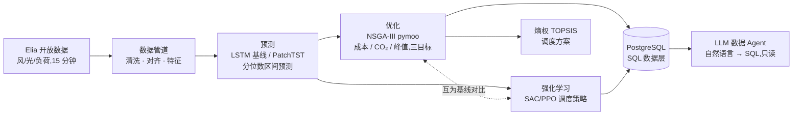

[English](README.md) | **简体中文**

# 微电网调度:预测 → 多目标优化 → 强化学习

一个端到端的"预测 → 优化 → 学习型决策"微电网项目:深度学习功率/负荷预测 +
NSGA-III 多目标日前调度 + 强化学习调度策略,上层再叠一个 PostgreSQL 数据层和
一个 LLM 数据 Agent。本科毕业论文《NSGA-III 多目标优化算法的程序设计与应用》的
Python 重写与升级版。

数据全部来自比利时电网运营商 Elia 的公开数据(2019–2024,15 分钟粒度)。
**指标一律诚实报告,包括打不过基线的部分**——项目里最有价值的一段结论,恰恰是
"我发现自己的模型不如它的输入,并把原因定位清楚了"。

## 架构



| 模块 | 状态 |
|------|------|
| 数据管道 —— Elia 2019–2024,清洗、对齐、因果特征 | 已完成 |
| 日前概率预测 —— seq2seq LSTM,分位数区间 | 已完成 |
| NWP 气象特征 | 进行中 |
| PatchTST 预测器、SHAP 归因 | 计划中 |
| NSGA-III 多目标调度 + 熵权 TOPSIS | 已完成 |
| 强化学习调度策略(SAC)+ 三方对比 | 已完成 |
| PostgreSQL 数据层 | 已完成 |
| LLM 数据 Agent(自然语言 → SQL) | 已完成 |

---

# 结果

## 数据

比利时电网 2019-01 → 2024-12,15 分钟粒度,共 21 万行。风电和负荷六年完整;
**光伏数据集本身从 2020-07 才开始**,所以 2020 年年中之前的样本窗口对所有目标
都会被丢弃(编码器要读三条序列)。这类数据可得性的限制被明确记录在
`data/processed/elia_quality_report.json` 里,而不是悄悄填掉。


## 日前概率预测

### 任务与设置

**日前(day-ahead)** 指站在今天零点预测未来 24 小时——这是电力市场的实际节奏,
不是随便选的时间尺度。15 分钟一个点,一天 96 步。

输出的不是一个数,而是 **0.1 / 0.5 / 0.9 三个分位数**,构成一条 80% 预测区间。
调度是要冒风险的:如果预测说"风电 800 MW"而真值只有 500,电池就不够用,得高价
买电。区间预测把这份不确定性交给下游,点预测则把它扔掉了。

**划分严格按时间顺序,从不打乱**:训练 → 2024-09(约 1.8 万个窗口),验证 =
2024-10(372 个),测试 = 2024-11~12(721 个)。测试期在最终评估前不碰。样本
归属由其**预测时域**决定——历史窗口可以伸进上一段,那是发布时刻的已知信息,不是
穿越;而标签绝不跨段。

**模型**:seq2seq LSTM,约 4 万参数,CPU 上每个目标训练约 1 分钟。编码器读过去
24 小时的实测风/光/负荷;解码器只吃**发布时刻已知**的特征(日历周期编码 + Elia
公布的日前预报)。采用**直接多步预测**——模型自己的输出从不回流成输入,因此误差
不会沿时域累积。

### 结果

测试集 721 个窗口,所有基线都在**完全相同的窗口**上评估:

| 目标 | MAE (MW) | vs 持续法 | vs Elia 日前 | vs 偏差修正后的 Elia | 80% 覆盖率 |
|------|---------:|----------:|-------------:|---------------------:|-----------:|
| 负荷 | 256.1 | +50.2% | +0.2%(打平) | +1.3% | 0.827 |
| 光伏 |  92.2 | +46.4% | **+3.1%**    | +6.5% | 0.646 *(白天)* |
| 风电 | 225.1 | +79.4% | **−21.6%**   | +6.1% | 0.852 |

三个参照的 MAE(负荷 / 光伏 / 风电):季节性持续法 514.2 / 172.1 / 1093.3;
Elia 日前预报 256.6 / 95.1 / 185.1;以及一个**零参数**的后处理基线——按钟点统计
Elia 的平均偏差再减掉——259.3 / 98.6 / 239.8。

两个基线各有分工。**持续法("明天等于昨天")是诚实的下限**,任何模型打不过它就
不必谈了。**Elia 的日前预报是很硬的上限对手**:对方有数值天气预报、有专职团队、
有几十年运行经验。而那个零参数基线的作用是设一条及格线——任何更复杂的方法必须
先打赢五行代码。

### 这些技巧到底从哪来?

上面那张表不能自己解释自己。**Elia 的日前预报本身就是模型的一个输入特征**,所以
"比持续法好 79%"既可能说明模型强,也可能只说明它抄了一个好答案。三个消融实验,
每个只动一个变量,把这件事查清楚。

#### 消融一:把 Elia 的预报从输入里拿掉

| 目标 | 仅历史 + 日历 | 加上 Elia 日前预报 |
|------|-------------:|------------------:|
| 负荷 | 482.4 *(vs 持续法 +6.2%)* | 256.1 *(+50.2%)* |
| 光伏 | 168.4 *(+2.1%)*           |  92.2 *(+46.4%)* |
| 风电 | 1299.7 *(**−18.9%**)*     | 225.1 *(+79.4%)* |

没有它,模型只比"明天等于昨天"好一点点,**风电甚至更差**。也就是说,首页那几个
漂亮的技巧分,实质是 Elia 的预报被传递了过去;模型自己的贡献,是它在此之上叠加
的那个修正量。

这个结论不能靠猜,只能靠把特征拿掉再跑一次。

#### 消融二:多给四年训练数据(3300 → 18000 个窗口)

原来的训练期是 2024 年 1–9 月,**里面一个 11 月和 12 月都没有**。而测试集正是
11–12 月——`doy_sin` / `doy_cos` 这两个年内周期编码,在测试时取到的值训练中一次
都没出现过,模型是在纯外推。

| 目标 | 训练于 2024-01…09 | 训练于 2020-07…2024-09 |
|------|-----------------:|----------------------:|
| 负荷 | 260.1 *(vs Elia −1.4%)* | 256.1 *(**+0.2%**)* |
| 光伏 | 105.6 *(−11.0%)*        |  92.2 *(**+3.1%**)* |
| 风电 | 225.3 *(−21.7%)*        | 225.1 *(−21.6%)* |

**季节覆盖是光伏和负荷的瓶颈**——两者都从落后 Elia 翻成打平或反超,而模型结构、
超参数、代码一行都没改。光伏的幅度最大(落后 11.0% → 领先 3.1%),这符合物理:
光伏出力由日照长度和太阳高度角主导,只训练 1–9 月等于从没见过冬天的太阳几何。

**风电则纹丝不动。** 5.4 倍的数据、4 个额外的冬季,测试 MAE 从 225.3 变成 225.1。

#### 消融三:同一个 checkpoint,在三个划分上分别评估

MAE,单位 MW:

| 目标 | 模型(train / val / test) | Elia(train / val / test) |
|------|--------------------------|---------------------------|
| 负荷 | 241.6 / 186.4 / 256.1 | 249.1 / 177.7 / 256.6 |
| 光伏 | 107.7 / 141.7 /  92.2 | 109.4 / 138.0 /  95.1 |
| 风电 | 232.7 / 240.0 / 225.1 | 269.5 / 209.9 / 185.1 |

负荷和光伏的模型误差**跟着 Elia 一起动**:某个时段本身难报,两边一起变差;好报,
两边一起变好。说明模型确实在跟踪真实的可预报性。

风电不是。**模型误差在三个时段上恒定在 225–240 MW,而 Elia 从 269 一路降到 185。**

这就是问题的全部所在。Elia 的误差会波动,是因为它在跟踪天气系统的可预报性——好报
的时段它报得准。而模型有一个约 225 MW 的**地板**,条件变好的时候它跟不下去,因为
它根本不知道条件变好了。

它在训练集上"赢" Elia 37 MW,不是本事:那是 2020–2024 这段时期 Elia 恰好比测试
窗口差,而模型的地板刚好比它低。**赢的是对手的差时段,不是自己的好状态。**


按预测时域拆开看,结论完全一致。把 MAE 在 96 个预测步上取平均,会掩盖结构:第 1 步
只提前 15 分钟,第 96 步提前 24 小时,难度天差地别。模型只在时域最前面约 1 小时内
赢 Elia(那里近期实测占主导),之后就走平,并在 Elia 曲线上方平行延伸剩下的 23 小时。

#### 结论

**光伏和负荷是数据受限,风电是信息受限。**

用功率历史和日历特征去后处理一个已经基于数值天气预报的日前预测,能榨的余量已经
榨干了——剩下的误差是真实的天气不确定性,而这个东西根本不存在于电力时间序列里。

所以下一步是数值天气预报(NWP)特征。而且这里**事先记录一个可证伪的预期**:

> 如果 NWP 真的被用上了,风电的 MAE 应该开始**随时段波动**,像 Elia 那样在好报的
> 时段跟着降下去,而不是继续卡在约 225 MW 的地板上。

这比"看 MAE 降了多少"信息量大得多——它预先规定了什么样的结果算成功、什么样算失败。

### 已知局限

- **光伏的预测区间在样本外偏窄。** 白天覆盖率 0.646,名义值是 0.80。训练集上是
  0.811,所以这是区间**宽度**的泛化失效,不是欠拟合。负荷基本校准(0.827),
  风电略宽(0.852)。
- **对光伏而言,全时段覆盖率具有误导性。** 夜间真值恒为零,任何包含零的区间都算
  "覆盖"。有意义的是白天那个数,两者都记录在
  `models/<run>/diagnosis_<split>.json` 里。夜间还留有一个伪影:模型在 **71%**
  的夜间时刻给出**大于零**的 10% 分位数,于是真值 0 落在区间下方,判为未覆盖。
  代码里对预测施加了物理单位上的非负约束(光伏和风电出力不可能为负),但这个
  约束**在数学上不可能修好这一项**:把**负**的下界抬到 0,真值 0 在两种情况下
  都被覆盖;而那 71% 的正下界根本不受影响。要真正消除它,需要用太阳高度角在
  日落到日出之间把所有分位数强制置零。这里**有意保留**:涉及的误差是夜间几个
  MW,降尺度到假想微电网后约 0.4 kW,可忽略;而判断区间质量的标准是白天覆盖率。
- **负荷领先 Elia 的 0.2%,换算过来是 256 MW 误差上的 0.5 MW**——这是打平,不是赢。
- 对比的只是 Elia 的**日前**产品。Elia 同时发布日内滚动更新,那个自然更准,但拿
  它当日前模型的参照并不公平。


---

## 日前多目标调度(NSGA-III:成本 / CO₂ / 电网峰值)

> **注意**:本节及下一节的数字,是用**单年训练**的 LSTM 预测算出来的(即
> `models/*_lstm/`,而非改进后的 `*_lstm_multiyear`)。用新预测重跑整条下游链路
> 并量化"预测变准 → 调度成本降低"的传导,是一项待办工作。

全国尺度的预测被**降尺度**到一个假想微电网(峰值负荷 4 MW、风电装机 2 MW、光伏
装机 3 MW;缩放因子由各序列的年最大值推出,定义在 `configs/system/default.yaml`)。

对给定的一天(96 × 15 分钟),在三个目标上求解日前 Pareto 前沿:**运行成本 /
CO₂ 排放 / 电网峰值功率**。决策变量是燃气轮机和电池的逐步出力,
`x = [P_mt(96), P_bat(96)]`(`P_bat > 0` 放电,`< 0` 充电);**电网联络线功率是
功率平衡的松弛量,永远不进决策向量**。SoC 上下限、终端 SoC(日内能量中性)、
联络线 ±3 MW、轮机爬坡 ±0.5 MW/步,全部进入 pymoo 的**约束向量 G**,而不是折进
惩罚项。

**目标是可插拔的**:每个目标是一个纯函数(`src/microgrid/optimize/objectives.py`),
由 `configs/optimize/default.yaml` 里的 `objectives: [cost, co2, peak_grid]` 选中;
pymoo 问题的 `n_obj` 就是这个列表的长度。**删掉一项就得到一个合法的低维问题,零
代码改动**(`optimize.objectives=[cost,co2]` 退化为两目标)。设备、成本、排放因子
全部由 `system.yaml` 驱动:轮机的二次燃料成本 + 排放因子、电池的非对称充放电效率 +
吞吐量退化成本、分时电价买卖、碳排只计**进口**电量;`peak_grid = max_t |P_grid(t)|`
(削峰,缓解并网点压力——和钱、碳都正交,所以值得单独占一个维度)。

**为什么是三个目标?** NSGA-III 的核心是 Das–Dennis **参考方向**:它们均匀铺满目标
单纯形,并在环境选择中用参考点维持 **≥3 维**下的前沿分布——这正是它相对 NSGA-II
的价值所在。两个目标时拥挤距离(NSGA-II)就够了,NSGA-III 没有优势。因此本项目把
三目标(成本/CO₂/峰值)作为主场景。参考方向的密度随目标数自适应
(`ref_partitions` 按目标数配置;三目标默认 `p=12` → 91 个方向)。为了让种群逃出
终端 SoC 等式约束定义的那层很薄的可行流形,还加了**能量中性修复算子**(把充放电
能量按比例缩放到平衡)和启发式热启动,并用一个外部存档收集整个进化过程中出现过的
可行非支配解。

最后由**熵权 TOPSIS** 选出折中点:每个目标先在**当前前沿上**做 min-max 归一化再算
熵权(这可以避免成本这类"基线绝对值大、相对变化小"的目标被误判为"近似常数"而权重
塌缩);方法自然推广到 m 个目标。**膝点**(到前沿两端点连线的最大垂距)只在二维时
有清晰几何意义,所以只在两目标运行时报告,并在 `solution.json` 中注明。完整的
`python scripts/optimize_dispatch.py optimize.day=2024-11-15` 在 CPU 上约 15 秒。

对 2024-11-15(风/光/负荷取 LSTM 中位数预测):前沿含 **650 个非支配解**,成本约
7.3k–8.0k EUR/日,CO₂ 21–29 t/日,电网峰值 1.6–3.0 MW,呈现清晰的权衡(越便宜 ⇒
碳越多、峰值越高)。归一化后的熵权是成本 0.40 / CO₂ 0.31 / 峰值 0.28(量级相当,
权重较均衡),TOPSIS 选出一个**内部折中点:≈ 7396 EUR、≈ 25.9 tCO₂、≈ 2.04 MW
电网峰值**(下图中的红色星标)。


> **关于净上网**:缩放后风电 + 光伏装机(2 + 3 = 5 MW)超过峰值负荷(4 MW),
> 所以高渗透率的日子应该出现向电网净上网(售电价 = 0.4 × 购电价、无碳排信用、
> 联络线限 ±3 MW——全部已实现并有单元测试)。但 11–12 月测试窗口是冬季,光伏近乎
> 为零:实测数据里可再生出力从未在任何一步超过负荷(全年只有约 0.85 MW 的峰值
> 余量),因此调度全程由购电主导。缩放参数**没有**为了制造或规避上网而调整;
> 上网路径会在高光照的夏季自然触发。

## 强化学习调度策略(SAC,闭环)vs NSGA-III 与规则基线

日前调度被重述为一个**序贯决策**问题:一天 96 × 15 分钟是一个 episode;每一步
智能体输出轮机和电池功率 `[P_mt, P_bat]`(动作 ∈ [-1,1],仿射映射到设备边界);
电网联络线仍然是功率平衡的**派生松弛量**。

- **环境**(`src/microgrid/rl/env.py`,通过官方 `gymnasium` `env_checker`):物理
  **完全复用** `system.py`——为闭环补充了逐步原语(`soc_step` / `fuel_cost_step` /…),
  并用单元测试断言"逐步求和 == 原来的整日向量化函数",即环境**不引入任何新物理**
  (物理的定义只有一处)。**可行性靠投影而非惩罚**:动作先被裁剪进爬坡可行区间
  (P_mt)和 SoC 可行区间(P_bat),投影量作为诊断记录下来。观测(全部归一化)
  包含 SoC、日内步序的正弦编码、当前实测风/光/负荷、未来 2 小时的 LSTM 中位数
  预测、当前和下一步购电价、以及剩余步数比例。
- **奖励**:逐步的 `-(Δ成本 + 碳价·ΔCO₂)/scale` 累加,加上终端的
  `-(w_soc·|SoC_T−SoC_0| + w_peak·电网峰值)`——这样三个对比指标(成本/CO₂/峰值)
  都对训练施加压力。**一个非平凡的调参教训**:`w_soc` 必须**大于**把电池初始电量
  放光所带来的套利收益(放空一次约 266 EUR),否则策略会理性地在日终把电池清空以
  压低成本——这对能量中性的 NSGA / 规则基线是不公平的作弊(症状:`soc_dev` 卡在
  0.35)。把 `w_soc` 从 500 提到 1500 后恢复近似能量中性(`soc_dev ≈ 0.03`)。
- **SAC**(Soft Actor-Critic,一种面向连续动作的 off-policy 强化学习算法,最大化
  回报加策略熵以维持探索;`stable-baselines3` 实现)在预测训练期(1–9 月)训练,
  10 月验证,**在最终对比前从不接触** 11–12 月。训练是**限时可续**的(保存回放
  缓冲和 checkpoint,学习曲线增量落盘),在 CPU 上约 13 万步收敛;验证成本
  5017 → 4826 EUR。PPO 是有文档的备选开关(`rl=ppo`)。

**三方对比**(`scripts/compare_dispatch.py`,61 个测试日,11–12 月):三种方法拿到
**同一份 LSTM 中位数预测**,并通过**同一条物理路径**(`rollout.simulate`)对**实测
真值**执行——NSGA-III+TOPSIS 每天重新优化(全预算,约 10 秒/天)后**开环**执行;
RL 策略**闭环**滚动(边观测真值边决策);规则基线闭环。

| 方法 | 实际成本 (EUR) | CO₂ (t) | 电网峰值 (MW) | 终端 SoC 偏差 | 联络线越限 (步/天) | 决策延迟 |
|------|:---:|:---:|:---:|:---:|:---:|:---:|
| 规则基线 | 5317 | **16.9** | 2.97 | 0.113 | 4.6 | 0.04 ms/步 |
| NSGA-III+TOPSIS | 5456 | 18.6 | **1.90** | **0.00** | **0.0** | 10.3 s/天(求解) |
| **RL (SAC)** | **5220** | 20.4 | 2.57 | 0.05 | 1.6 | 0.37 ms/步 |

> **成本差异需要配对统计,不能只看均值**:单日成本的日间波动极大(三种方法都在
> σ ≈ ±1700 EUR 量级),远超方法均值之间约 200 EUR 的差距——只比均值无法确立
> "谁更便宜"。把方法**在同一天上配对**再做差,可以把日效应消掉:**RL vs 规则基线**
> −98 ± **212** EUR/天,RL 在 61 天中的 **72%** 更便宜;**RL vs NSGA** −236 ± 181
> EUR/天,**87%** 的日子更便宜;NSGA vs 规则基线 +138 ± 115 EUR/天(NSGA 只在 8%
> 的日子更便宜)。配对后的 σ(±180–212)远小于单方法的日间波动(±1700),所以
> RL 的成本优势是统计上站得住的,而不是被方差淹没的噪声。


**诚实的结论是:没有方法全面占优,三者有清晰的分工。**

- **RL 最便宜、最快、对预测误差最鲁棒**:平均实际成本比规则基线低 1.8%、比 NSGA
  折中点低 4.3%,配对到同一天后分别在 **72% / 87%** 的日子更便宜;训练完成后单次
  决策只要 0.37 ms,可支撑实时闭环;把预测误差放大 0→3 倍(上图右),RL 的成本
  几乎不动(约 6000 EUR,最低且最平),因为它闭环观测真值而不依赖离线计划。
  **代价**:CO₂ 最高(碳价只设了 30 EUR/t,奖励因此偏向省钱)、黑箱、需要训练。
- **NSGA-III 的硬约束保证最强、峰值最优**:它显式优化整日 Pareto 前沿,终端 SoC
  精确归零、联络线零越限、电网峰值最低(1.90 MW)——一份可审计的日前离线计划。
  **代价**:每天约 10 秒求解,且**开环**执行——预测越差它越吃亏(蓝色曲线随误差
  单调上升),总成本最高。
- **规则基线 CO₂ 最低、免训练、可解释**,但削峰最差(2.97 MW,逼近联络线限值)、
  终端 SoC 漂移最大、越限最多;因为它完全不看预测,鲁棒性曲线是一条水平线。

一句话:**要离线且有硬约束保证 → NSGA-III;要在线实时且抗预测误差 → RL;要一条
可解释的最低保障 → 规则基线。** 价值不在"RL 赢了",而在三者在同一套物理引擎、
同一份预测下的一次诚实、可复现的对比。

## SQL 数据层 + 数据 Agent(自然语言查询)

管道的产出(实测、预测、调度实验)原先散落在 parquet/JSON 文件里,现在被装载进一个
**PostgreSQL 关系层**:5 张表、约 26 万行、幂等批量装载(COPY 进临时表 +
`ON CONFLICT DO UPDATE`)、每张表每个字段都有业务 `COMMENT`,外加 8 条带业务结论的
分析查询(`sql/analysis/`)。

数据库之上是一个 **LLM 数据 Agent**(`scripts/ask_data.py`):通过
`list_tables / get_schema / run_query` 三个工具,模型自主探索表结构(建表时写的
字段注释同时充当它的语义标注)、编写并执行 SQL、出错后自我纠正,最后用提问所用的
语言给出带数字引用的回答。

```bash
python scripts/ask_data.py --show-trace "2024 年哪个月的风电预测误差最大?"
```

一次真实的带轨迹运行(提问:"LSTM 和 TSO 的风电预测哪个更准?";DeepSeek 后端;
下面是单次运行的完整轨迹):


第 2、3 步**没有任何人工提示**:第一次 LEFT JOIN 得到的 TSO MAE 是 204.5,被全年
数据稀释了;Agent 自己检查了覆盖范围并修正了对比口径。

值得一提的是,这个 Agent 独立算出的 185.2 vs 225.6,与上文预测章节的离线诊断
(185.1 vs 225.1)相互印证——两条完全不同的代码路径得到同一个结论。

安全是**双保险**的:一个纯函数 SQL 校验器(只允许单条 SELECT/WITH;拦截写关键字、
多语句注入、`SELECT INTO`、以及会改数据的 CTE)+ 数据库侧的 `READ ONLY` 事务和
语句超时——**模型生成的 SQL 永远不被信任,规则由数据库强制执行**(和唯一键约束
是同一个哲学)。任何 OpenAI 兼容端点都可用(`configs/agent/default.yaml`);
API key 只从环境变量读取。

---

# 快速开始

```bash
pip install -r requirements.txt
pip install -e .

# 1. 下载 Elia 数据(风 ods031 / 光 ods032 / 负荷 ods001)
#    按自然年分块存到 data/raw/elia/<series>_<year>.csv,可续传:
#    已在磁盘上的年份会跳过,重跑只补缺失的部分。默认范围 2019–2024。
#    只要单年:python scripts/download_data.py data.date_start=2024-01-01
python scripts/download_data.py

# 2. 构建模型就绪的数据集(清洗 → 对齐 → 特征):parquet + 质量报告
python scripts/build_dataset.py

# 3. 生成数据探索图 -> reports/figures/
python scripts/explore_data.py

# 4. 训练日前预测模型(LSTM 基线,CPU 上每个目标约 1 分钟)
python scripts/train_forecast.py forecast.target=load
python scripts/train_forecast.py forecast.target=wind
python scripts/train_forecast.py forecast.target=solar

#    forecast.run_name 给每次运行单独的目录,消融实验之间不会互相覆盖
#    (已完成的运行会因为 DONE 标记而被跳过):
python scripts/train_forecast.py forecast.target=wind \
    forecast.use_tso_forecast_input=false forecast.run_name=wind_lstm_notso

# 4b. 诊断已训练的预测器:分时域 MAE(vs Elia vs 持续法)、零参数偏差修正基线、
#     白天时段的区间覆盖率
#     -> models/<run>/diagnosis_<split>.json + reports/figures/forecast_diagnosis_*.png
python scripts/diagnose_forecast.py forecast.target=wind
python scripts/diagnose_forecast.py forecast.target=wind forecast.diagnose_split=train

# 5. 日前多目标调度(NSGA-III:成本/CO₂/电网峰值;熵权 TOPSIS 选点)
#    -> reports/figures/dispatch_*.png + models/dispatch_<day>/solution.json
python scripts/optimize_dispatch.py optimize.day=2024-11-15
python scripts/optimize_dispatch.py scenario=price_spike       # 命名场景(峰价 ×3)

# 6. 强化学习调度策略(SAC;1–9 月训练 / 10 月验证;限时、可续训)
#    -> models/rl_sac/{best,last}.zip + eval.csv 学习曲线
python scripts/train_rl.py                       # 完整 SAC 训练(CPU 约 2 小时内)
python scripts/train_rl.py rl=ppo                # 备选开关:改用 PPO
python scripts/train_rl.py rl.train.max_seconds=470   # 一个限时切片;重跑即继续

# 7. 三方对比(RL vs NSGA-III+TOPSIS vs 规则基线;11–12 月测试,可续跑)
#    -> models/comparison/comparison.json + reports/figures/dispatch_comparison_*.png
python scripts/compare_dispatch.py

# 8. SQL 层 + 数据 Agent(需要本地 PostgreSQL;连接信息走 PG* 环境变量或 .env)
python scripts/load_to_db.py                     # 建表 + 幂等装载(默认库名 microgrid)
python scripts/ask_data.py "LSTM 和 TSO 的风电预测哪个更准?"
python scripts/ask_data.py --show-trace "哪种调度方法最便宜?"   # 打印每一步 SQL

# 单元测试(不需要真实数据;重型运行默认排除)
pytest              # 快速套件(pyproject 里预置了 -m "not slow")
pytest -m slow      # 场景端到端 + RL 冒烟:降预算 NSGA-III / 小规模 SAC 训练 + 断言
```

# 设计原则

- **用一个规范数据模式作为解耦边界**:每个数据源适配器都产出同一套长格式模式
  (`src/microgrid/schema.py`);下游的清洗/对齐/特征模块永远不知道数据来自哪里。
- **用配置组合,而不是注册表**:可插拔组件(数据源、预测模型、调度目标)在 yaml
  里用导入路径声明(`_target_: microgrid.x.y.Class`),由**唯一的装配中间件**
  `src/microgrid/assemble.py`(hydra `instantiate` 的薄封装)实例化——没有装饰器
  注册表,没有名字→类的字典,没有 import 副作用。**加一个组件 = 一个新模块 + 一行
  yaml**。脚本和管道只调用装配器;模块之间从不互相 import 具体类。
- **配置驱动**:hydra 可组合 yaml(`configs/`);数据源字段名、清洗阈值、特征参数、
  目标列表、场景定义全部外置——改参数或换数据源不需要动代码,例如
  `python scripts/build_dataset.py cleaning.interpolate_gaps.max_gap_steps=16`、
  `optimize.objectives=[cost,co2]`。
- **纯函数式的管道阶段**:清洗规则和特征构造都是 `(df, cfg) -> df`,可独立测试;
  所有特征都是因果的(只用过去信息),滚动统计用显式的 `shift(1)` 防标签泄漏,
  并有对应的单元测试。
- **场景系统**:`configs/scenario/*.yaml` 定义命名场景(日期、系统参数覆盖、期望
  性质断言)。运行时 `python scripts/optimize_dispatch.py scenario=price_spike`;
  测试侧 `tests/test_scenarios.py` 自动发现每个 yaml 并参数化(测试 id = 文件名),
  跑降预算的优化并检查断言——**新增一个场景 = 一个新 yaml,测试代码零增长**。
- **可审计的数据质量**:长缺口从不被静默填充;管道会在每个数据集旁产出
  `quality_report.json`(缺失率、最长缺口、取值范围)。
- **诊断优先于优化**:换模型之前先测清楚瓶颈在哪。预测章节里那三个消融实验就是
  这条原则的产物——它们花了半天,却推翻了一个错误的假设,并把后面几周的方向定了下来。

# 目录结构

```
configs/            # hydra 配置组:pipeline / data / cleaning / features / system
  optimize/         #   优化设置 + objectives/(每个目标一个 _target_ 文件:cost · co2 · peak_grid)
  scenario/         #   命名场景(winter_weekday / winter_weekend_low_load / price_spike)
  agent/            #   数据 Agent 设置(端点、模型、步数预算、行数/超时限制)
sql/                # 建表 DDL(5 张带注释的表)+ 8 条业务分析查询
src/microgrid/
  schema.py         # 规范数据模式(模块间的契约)
  assemble.py       # 唯一的"配置 → 实例"装配器(build_source / build_model / build_objectives)
  data/sources/     # 数据源适配器(elia / gefcom2014,由 yaml _target_ 装配)
  data/             # 清洗 / 对齐 / 特征(纯函数阶段)
  forecast/         # 窗口数据集 / 分位数损失 / 指标 / 基线 / 训练器 / 评估 / 诊断
  forecast/models/  # 模型(lstm;PatchTST 按同一 forward 契约预留)
  optimize/         # 设备物理(纯函数,含逐步原语)/ 目标 / pymoo 问题 /
                    #   NSGA-III / 熵权 TOPSIS / 场景覆盖 / 每日输入 / 报告
  rl/               # 强化学习调度:env(gymnasium)/ data(日profile)/ baseline(规则)/
                    #   rollout(闭环执行 + 指标)/ train(SAC/PPO,可续训)/ report
  sql/              # SQL 层:db.py(连接 / COPY / upsert)/ extract.py(纯 DataFrame→行 变换)
  agent/            # 数据 Agent:tools / guard(SQL 校验器)/ loop(function-calling)/ prompts
  pipeline/         # 阶段编排 + 质量报告
  viz/              # 探索性可视化
scripts/            # 命令行入口(hydra;train_forecast / diagnose_forecast / train_rl / …)
tests/              # 单元测试(合成数据,不下载);重型场景与 RL 冒烟标记为 @slow
data/               # raw / interim / processed(git 忽略)
```

# 路线图

1. **已完成** —— 数据管道:Elia 风/光/负荷;清洗、15 分钟对齐、因果特征;按年分块可续传的下载
2. **已完成** —— 预测(阶段一):seq2seq LSTM 基线、分位数区间预测、无泄漏的窗口划分、限时可续训练。
   **消融驱动的诊断确立了:光伏和负荷是数据受限**(训练期从 9 个月扩到 4.2 年,两者
   都从落后 Elia 翻成打平或反超),**而风电是信息受限**(5.4 倍数据毫无改变;模型
   误差在各时段恒定,而 Elia 的误差跟踪真实可预报性)
3. **进行中** —— 预测(阶段二):**NWP 气象特征**——按阶段一的诊断,这已不是可选的锦上添花,
   而是风电唯一剩下的手段;随后是插进同一框架的 PatchTST,以及 SHAP 可解释性
4. **已完成** —— 优化:pymoo NSGA-III 日前调度(成本/CO₂/电网峰值,可插拔目标)、熵权 TOPSIS
   选点、命名场景系统
5. **已完成** —— 强化学习:SAC 闭环调度策略,与 NSGA-III / 规则基线的三方对比(成本 / CO₂ /
   峰值 / 决策延迟 / 预测误差鲁棒性);物理复用单一来源 system.py;限时可续训练
6. **已完成** —— SQL 层:PostgreSQL,5 张表约 26 万行,幂等装载(COPY + ON CONFLICT),每张表
   每个字段的业务注释,8 条分析查询
7. **已完成** —— 数据 Agent:LLM 工具调用循环(探索表结构 → 编写 SQL → 出错自我纠正)、双保险
   只读安全(纯函数校验器 + READ ONLY 事务)、任意 OpenAI 兼容端点、通过注入假
   LLM 客户端实现完全离线的单元测试
8. **计划中** —— 用改进后的多年预测重跑下游调度与 RL 对比,量化"预测变准 → 实际调度成本降低"
   的传导
